# 3.1. Phần mở đầu

Các khái niệm cở bản được sử dụng trong những phương pháp phân tích mức chiếm dụng hữu ích  hiện có:

## Cấu trúc dữ liệu đầu vào
Một dòng dữ liệu (data stream) bao gồm nhiều giao dịch, và mỗi giao dịch gồm các cặp **(item, quantity)**.

Tập các item trong dữ liệu được ký hiệu là  
**I = {i₁, i₂, …, iₙ}**.

Mỗi giao dịch có một mã định danh duy nhất **tid**, và với mọi giao dịch Tk ta có:  **Tk ⊆ I** và **DB = {T₁, T₂, …, Tₘ}**.
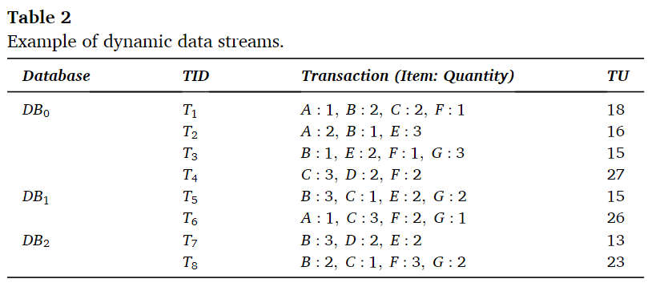

Dòng dữ liệu động trong Bảng 2 gồm **một dòng dữ liệu gốc** và **hai dòng dữ liệu bổ sung**.
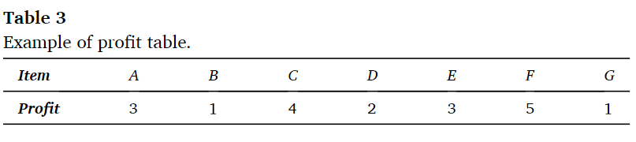

**Bảng 3** trình bày bảng lợi nhuận (profit table) chứa **utility bên ngoài (external utilities)** của từng item.

DUOCA sử dụng một tham số gọi là **hệ số suy giảm (decaying factor)** vì phương pháp này dựa trên kỹ thuật **damped window approach** [17,51].  
Giá trị suy giảm làm giảm utility của các mẫu theo thời gian, được ký hiệu là **f**, là một số thực nằm trong khoảng **0 đến 1**.

### Định nghĩa utility trong từng giao dịch
Một mẫu (pattern) thuộc giao dịch **Td** được ký hiệu là **P**, và các item thuộc P được ký hiệu là **iₚ**.
- **eu(iₚ)**: lợi nhuận (profit) của item iₚ
- **iu(iₚ, Td)**: số lượng item iₚ trong giao dịch Td

Khi đó:
- **Utility của item iₚ trong Td**:  
    **u(iₚ, Td) = eu(iₚ) × iu(iₚ, Td)**

- **Utility của mẫu P trong Td**:  
    **u(P, Td) = Σ u(iₚ, Td)**, với iₚ ∈ P ⊆ Td

Utility của toàn giao dịch **Td** được ký hiệu là **tu(Td)** và được tính như sau:
	**tu(Td) = Σ u(iₓ, Td)**, với mọi item iₓ ∈ Td.

### Support và Utility Occupancy
- Support của P là số giao dịch chứa P, ký hiệu:  
    **sup(P)**

- **Utility occupancy của P trong giao dịch Td**:  
    **uo(P, Td) = u(P, Td) / tu(Td)**

- **Utility occupancy tổng quát của P trong toàn bộ DB**: 
    **uo(P) = Σ uo(P, Td) / sup(P)**, với P ⊆ Td ⊆ DB.

### Thứ tự toàn cục (global list order)

Với hai item bất kỳ **iₚ** và **i_q**, nếu **iₚ đứng trước i_q** trong danh sách toàn cục (global list), ta ký hiệu:  
**iₚ ≺ i_q**.

### Điều kiện để P là High Utility Occupancy Pattern (HUOP)

Một mẫu **P** được xem là **mẫu có mức chiếm dụng tiện ích cao** nếu:
1. **uo(P) ≥ β**  
    (vượt ngưỡng utility occupancy tối thiểu)
2. **sup(P) ≥ α × |DB|**  
	    (vượt ngưỡng support tối thiểu nhân với số giao dịch đã quét)

# 3.2. Quy trình tổng thể của việc khám phá high utility occupancy pattern với damped window

Hình 1 mô tả toàn bộ luồng hoạt động của phương pháp được đề xuất. Phương pháp này bao gồm ba quy trình chính:

1. **Construction Procedure (Quy trình Xây dựng)**
2. **Restructure Procedure (Quy trình Tái cấu trúc)**
3. **Pattern Expansion Procedure (Quy trình Mở rộng Mẫu)**

Trong **Construction Procedure**, thuật toán xử lý các giao dịch từ dữ liệu được quét và xây dựng _global DUOCA-List_. Quy trình này sẽ được lặp lại bất cứ khi nào dữ liệu mới được quét, và danh sách toàn cục sẽ được cập nhật với thông tin bổ sung.

Sau đó, **Restructure Procedure** được thực thi.  
Trong quy trình này:
- Global list được **sắp xếp theo thứ tự tăng dần của support**
- Các giá trị **ruo**, **Sduo**, và **Srduo** được tính toán (mô tả chi tiết trong Mục 3.4

Ở bước này, việc tính **ruo** được thực hiện, còn việc tính **Sduo** và **Srduo** sẽ được thực hiện sau khi **giá trị suy giảm (decaying value)** tương ứng được tính.

Tiếp theo, **Pattern Expansion Procedure** được chạy với global list đã tái cấu trúc.  
Quy trình này nhằm **khám phá các damped high utility occupancy patterns** bằng cách tạo ra các _conditional lists_ với các phép so sánh hai chiều (two-way comparisons).

Trong quy trình thứ ba, quá trình mở rộng mẫu được tiến hành theo phương pháp **DFS (Depth-First Search)** và đệ quy để trích xuất các mẫu với mọi độ dài.

Khi tất cả các bước hoàn tất, kết quả sẽ được trả về cho người dùng, và phương pháp sẽ chờ thêm dữ liệu mới được đưa vào.

# 3.3. Xây dựng cấu trúc dữ liệu toàn cục với dữ liệu gốc

## **Mô tả DUOCA-List và các định nghĩa liên quan**

Phần này mô tả **DUOCA-List**, một cấu trúc được thiết kế để quản lý thông tin _damped occupancy_ của một mẫu (pattern) và các giao dịch mà mẫu xuất hiện. DUOCA-List bao gồm một **global DUOCA-List**, và danh sách toàn cục này được sử dụng trong **Pattern Expansion Procedure** để tìm các mẫu kết quả.

DUOCA-List **không tạo ra các candidate patterns**, bởi vì nó lưu trữ đầy đủ toàn bộ thông tin cần thiết cho việc trích xuất mẫu. Do đó, phương pháp được đề xuất có thể tìm ra kết quả một cách hiệu quả **mà không cần quét lại dữ liệu**.

## **Định nghĩa 1. (Damped utility occupancy của một pattern)**

Damped utility occupancy của mẫu **P** trong giao dịch **Td** được ký hiệu là: **duo(P, Td)**

Giá trị này được tính bằng cách **nhân hệ số suy giảm (decaying factor) f** với **utility occupancy của P trong Td**.

Giả sử giao dịch cuối cùng trong dữ liệu có id là **T**, giao dịch Td có id là **t**, hệ số suy giảm là **f (0–1)**, ta có:
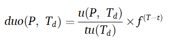

Damped utility occupancy của P trong toàn bộ dữ liệu D được tính bằng cách cộng tất cả các duo(P, Td) và chia cho **Sup(P)**:
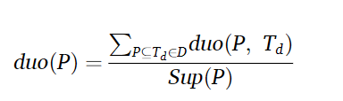

## **Định nghĩa 2. (Remaining damped utility occupancy của pattern)**

Remaining damped utility occupancy của mẫu **P** trong giao dịch **Td** được ký hiệu: **rduo(P, Td)**

Nó được tính bằng cách **nhân hệ số suy giảm f** với **remaining utility occupancy** của P trong Td.

Nếu T là tid cuối cùng, t là tid của Td, ta có:
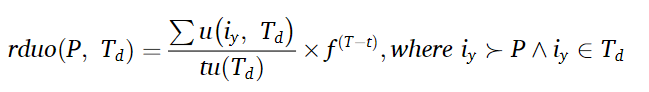

trong đó:
- là các item **đứng sau** item cuối của P trong global list (**i_y ≻ P**)
- và **i_y ∈ Td**.  

Remaining damped utility occupancy của P trong toàn DB:
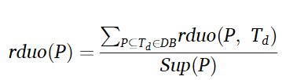

## **Định nghĩa 3. (Damped high utility occupancy pattern)**

Cho dữ liệu DB:
- **minSup(DB) = |DB| × α**, với α ∈ (0, 1] là ngưỡng do người dùng đặt
- **β (0 < β ≤ 1)** là ngưỡng damped utility occupancy

Một mẫu P được xem là **damped high utility occupancy pattern** nếu:
1. **Support(P) ≥ minSup(DB)**
2. **duo(P) ≥ β**

## **Cấu trúc DUOCA-List**
DUOCA-List chứa nhiều **node**, và mỗi node lưu thông tin về **một pattern**. Để lưu gọn thông tin của một pattern xuất hiện trong nhiều giao dịch, mỗi node gồm các phần:

**Một node DUOCA bao gồm:**
- Tên pattern
- Một tập entries
- Sduo
- Srduo

**Một entry bao gồm:**
- **tid** – mã giao dịch
- **uo** – utility occupancy
- **ruo** – remaining utility occupancy

## **Hai loại DUOCA-List**
Hệ thống tạo ra hai loại DUOCA-List:

**1. Global DUOCA-List**
- Lưu trữ thông tin của tất cả các bước quét trước
- Không xóa bất kỳ thông tin nào trong suốt quá trình
- Entry trong global list **không bị áp dụng decaying factor** (để xử lý damped window hiệu quả)

**2. Conditional DUOCA-List**
- Lưu thông tin của các pattern mở rộng (extended patterns)
- Có cấu trúc tương tự global list

## **Quy trình xây dựng DUOCA-List**

Khi bắt đầu Construction Procedure, DUOCA quét từng giao dịch trong dữ liệu:
1. Tính utility của giao dịch để có **tu(Td)**.
2. Duyệt từng item xuất hiện trong giao dịch.
3. Nếu item chưa có node tương ứng trong global list → tạo node mới:
    - **Khởi tạo Sduo = 0**
    - **Khởi tạo Srduo = 0**
4. Tạo **entry mới** trong node:
    - **ruo = 0**
    - **uo = utility(item) / tu(Td)**
5. Việc tính toán **uo, Sduo, Srduo kèm decaying factor sẽ được thực hiện trong Restructure Procedure**, không phải trong bước xây dựng.
### **Ví dụ 1.**

Ví dụ này giải thích quy trình xây dựng **global DUOCA-List** từ dữ liệu gốc.

Trước hết, **utility của item C** được tính bằng:  
	**2 × 4 = 8**,  
và **tu(T1)** là tổng utility của các item **A, B, C, F**, bằng:  
	**18**.

Tiếp theo là bước tạo node cho item **A**.  
Vì node tương ứng với A **chưa tồn tại** trong global list, một node mới của item A sẽ được tạo.

- **Sduo** và **Srduo** của node được khởi tạo bằng **0**
- Một **entry** tương ứng với giao dịch **T1** được chèn vào node của item A
- **ruo** của entry ban đầu được thiết lập bằng **0**
- Utility của item A trong T1 được chia cho **tu(T1)**, và giá trị sau chia được lưu vào **uo**

Việc tạo node cho các item **B, C và F** được thực hiện theo **cách hoàn toàn giống như** đối với item A.

# 3.4. Quá trình tái cấu trúc danh mục DUOCA-List toàn cầu đã được xây dựng
Trong phần này, một quy trình tái cấu trúc được cải tiến được trình bày nhằm hỗ trợ việc trích xuất hiệu quả các mẫu chiếm dụng tiện ích cao có áp dụng hệ số suy giảm (_damped high utility occupancy patterns_). Khi người dùng yêu cầu tìm kết quả, các _conditional list_ được sắp xếp lại dựa trên _global list_.

Trong môi trường dữ liệu dòng (_data stream_), toàn bộ thông tin — bao gồm cả dữ liệu trước đó — đều được quản lý trong _global list_. Điều này có nghĩa là, ngay cả khi tồn tại các node tương ứng với những mục (item) không hứa hẹn dựa trên dữ liệu hiện tại, thì các lượt quét dữ liệu bổ sung có thể biến các mục không hứa hẹn này thành những mục hứa hẹn. Bên cạnh đó, lượng hệ số suy giảm được nhân với mỗi giao dịch cũng liên tục được điều chỉnh.

Do vậy, các tác vụ **sắp thẳng hàng lại (realignment)**, **cắt tỉa (pruning)** và **áp dụng hệ số suy giảm (decaying factor application)** được thực hiện đồng thời trong quy trình tái cấu trúc để đạt được việc phát hiện mẫu một cách hiệu quả.

Khi quy trình tái cấu trúc được kích hoạt bởi yêu cầu tìm kết quả, _global list_ sẽ được sắp xếp theo **thứ tự tăng dần của độ hỗ trợ (support)** của các mục riêng biệt. Vì độ hỗ trợ của từng mục thỏa mãn tính chất phản đơn điệu (_anti-monotone property_), các mục có giá trị tiện ích nhỏ hơn _minSup_ sẽ bị cắt tỉa.

Trong bước này, mức độ quan trọng tương đối so với giao dịch mới nhất được áp dụng vào giá trị **uo** của mỗi entry để tính toán **duo**. Mỗi khi giá trị duo được tính cho một entry trong một node, giá trị đó sẽ được cộng dồn vào **Sduo** của node tương ứng. Sau khi quá trình duyệt qua tất cả các entry kết thúc, **Sduo được cập nhật mới** bằng cách chia giá trị Sduo hiện tại cho tổng số entry.

Ngoài ra, giá trị **ruo** của các entry trong mỗi node cũng được tính toán, vì _global list_ đã được sắp xếp theo thứ tự tăng dần của độ hỗ trợ. Trong giai đoạn tính toán ruo, một mảng tạm gọi là **temp-Table** được tạo. _Temp-Table_ bao gồm hai thông tin: **Suo** và **tid**.

- **Suo** lưu trữ tổng các giá trị _uo_ của các node đã được duyệt.
- **tid** dùng để nhận diện giao dịch tương ứng.

Các entry trong bảng này được tạo theo số thứ tự giao dịch của dữ liệu đã quét, cho phép việc tính toán **ruo** cho mỗi entry diễn ra hiệu quả.

Để tính ruo một cách tối ưu, _conditional list_ được duyệt theo **thứ tự ngược lại so với thứ tự sắp xếp**. Giá trị tid của danh sách hiện tại được so sánh với tid trong _temp-Table_. Nếu hai tid trùng nhau, **Suo** của _temp-Table_ được gán làm **ruo** của entry. Sau đó, giá trị **duo** của entry hiện tại được cộng vào **Suo** của entry tương ứng trong _temp-Table_.

Phần duyệt tiếp theo diễn ra tương tự, và _global list_ đã được tái cấu trúc sẽ được trả về khi quá trình duyệt hoàn tất.

## Ví dụ 2.

 Ví dụ này minh họa quy trình tính toán **Sduo** và **Srduo** của _global list_ trong giai đoạn tái cấu trúc. Phương pháp được đề xuất sử dụng **hệ số suy giảm (decaying factor)** sau khi sắp xếp _global list_ để tính toán Sduo và Srduo.

Giả sử ngưỡng hỗ trợ tối thiểu (minimum support threshold) được thiết lập là **0,3**. Vì kích thước của cơ sở dữ liệu ban đầu DB₀ là **4**, giá trị _minSup_ được tính bằng: **4 × 0,3 = 1,2**.

Do giá trị hỗ trợ của các mục (item) **D** và **G** nhỏ hơn **1,2**, các mục này sẽ bị loại bỏ (_pruned_).

Trong _global list_, mục đầu tiên của item **A** có giá trị **uo = 0,167**. Khi hệ số suy giảm được đặt là **0,8**, các entry có **tid = 1** sẽ được nhân với **0,8^(4−1)**, và **duo** của item A trong giao dịch **T1** được tính như sau: **0,167 × 0,8⁴⁻¹ = 0,086**.

Tương ứng, giá trị **0,086** được cộng vào **Sduo** của item A.

_Temp-Table_ được tạo ra dựa trên thông tin của item **F**, nằm ở vị trí cuối của _global list_ theo thứ tự sắp xếp đảo ngược. Các entry `{1, 3, 4}` cùng giá trị duo tương ứng được đưa vào _temp-Table_.

Các nút còn lại của _global list_ sẽ được tái cấu trúc bằng cách duyệt qua toàn bộ các nút không bị loại bỏ bởi ngưỡng hỗ trợ. **Hình 2** minh hoạ _conditional list_ được tái tạo thông qua các bước trên.

# 3.5. Cập nhật danh sách toàn cầu với dữ liệu động

Phần này mô tả quy trình chèn thêm dữ liệu mới trong môi trường dữ liệu dòng (_stream environments_). Các thông tin trước đó, bao gồm cả dữ liệu ban đầu, **không bị xóa** và được quản lý trong _global list_. Do đó, ngay cả khi dữ liệu mới được bổ sung, hệ thống **không cần đọc lại** dữ liệu đã tồn tại trong _global list_.

Khi dữ liệu bổ sung được đưa vào, giao dịch mới nhất sẽ thay đổi và giá trị suy giảm (_decaying value_) được tính toán lại. Nếu giá trị **damped utility occupancy** (giá trị chiếm dụng tiện ích có áp dụng hệ số suy giảm) được lưu cho từng entry trong mỗi node, thì mỗi lần dữ liệu mới được thêm vào sẽ gây **kém hiệu quả**, vì damped utility occupancy của từng entry đều phải được cập nhật lại.

Do đó, _global list_ chỉ lưu các giá trị **utility occupancy chưa áp dụng hệ số suy giảm**. Khi một giao dịch mới được quét, **transaction utility** của giao dịch được tính trước, sau đó thông tin của các item trong giao dịch được xử lý.

- Nếu node tương ứng của item đã tồn tại trong _global list_, một entry mới sẽ được thêm vào node đó.
- Ngược lại, nếu node tương ứng chưa tồn tại, một _list_ mới và một entry mới được tạo. Trong trường hợp này, quy trình xây dựng được mô tả tại **Mục 3.3** sẽ được áp dụng.

Giá trị **Sduo** và **Srduo** của list mới được khởi tạo bằng 0. Giá trị **uo** của mỗi entry được duy trì bằng cách lấy tiện ích của item chia cho _transaction utility_ tương ứng. Mỗi **ruo** cũng được khởi tạo bằng 0 vì thứ tự sắp xếp có thể thay đổi khi giao dịch mới được thêm.

Để tăng hiệu quả, quá trình **sắp xếp lại global list** chỉ được thực hiện khi có yêu cầu phân tích các mẫu kết quả. Tương tự, việc tính toán **ruo** cũng chỉ được thực hiện trong quy trình tái cấu trúc.

## Ví dụ 3. 

Ví dụ này minh họa cách cấu hình cấu trúc _global list_ đã được cập nhật sau khi xuất hiện các đợt quét dữ liệu bổ sung. **Hình 3** biểu diễn _global DUOCA-List_ đã được cập nhật và tái cấu trúc với hai tập dữ liệu **DB1** và **DB2**.

_Global DUOCA-List_ được sắp xếp lại theo **thứ tự tăng dần của giá trị hỗ trợ (support)** vừa được tính toán, ký hiệu là:

**D ≺ A ≺ E ≺ G ≺ C ≺ F ≺ B**.

Như ví dụ trước, ngưỡng hỗ trợ tối thiểu tiếp tục được đặt là **0,3**. Vì số lượng giao dịch đã quét tăng lên **8**, giá trị _minSup_ được xác định là:

**8 × 0,3 = 2,4**.

Do đó, item **D** bị loại bỏ vì giá trị hỗ trợ của nó thấp hơn **2,4**.

Vì entry đầu tiên trong node của item **A** có **tid = 1**, giá trị suy giảm (decaying value) được tính là **0,8⁸⁻¹**. Giá trị **duo** của item A trong giao dịch **T1**, được tính bằng:

**0,167 × 0,8⁸⁻¹**,

sẽ được cộng vào giá trị **Sduo** của item A.

Tương tự, các giá trị suy giảm tương ứng được gán cho tất cả các entry còn lại.

Sau đó, các giá trị **ruo** và **Srduo** của tất cả các node được tính toán dựa trên _temp-Table_. Cuối cùng, _global DUOCA-List_ đã được tái cấu trúc sẽ được trả về để tiến hành bước **mở rộng mẫu (pattern expansion)**.

# 3.6 Phân tích các mẫu chiếm dụng tiện ích cao với cơ chế cửa sổ suy giảm

Phần này giới thiệu quy trình mở rộng mẫu (_pattern extension process_) và các kỹ thuật cắt tỉa (_pruning techniques_). Thuật toán được đề xuất sẽ lặp qua _global list_ đã được tái cấu trúc và sắp xếp theo thứ tự tăng dần của độ hỗ trợ, đồng thời tiến hành bước mở rộng mẫu.

Độ hỗ trợ (_support_) của một mẫu thỏa mãn tính chất phản đơn điệu (_anti-monotone property_), và được tính bằng **số lượng entry trong node tương ứng**. Các mẫu xuất hiện ở phần đầu của _global list_ thu được sẽ được kết hợp với các mẫu còn lại trong danh sách.

Khi việc mở rộng được tiến hành từ các mẫu có độ hỗ trợ thấp, quá trình mở rộng mẫu có thể được thực hiện một cách hiệu quả hơn.

Trong phân tích các mẫu chiếm dụng tiện ích cao (_high utility occupancy pattern analysis_), có hai ngưỡng quan trọng:

- **Ngưỡng hỗ trợ tối thiểu (minimum support)**
- **Ngưỡng chiếm dụng tiện ích tối thiểu (minimum utility occupancy)**

Tuy nhiên, thước đo _utility occupancy_ **không thỏa mãn tính chất phản đơn điệu**. Do đó, phương pháp được đề xuất sử dụng **các kỹ thuật cắt tỉa dựa trên cận trên ước lượng (estimated upper bound)**.

## Định nghĩa 4. (Cận trên tiền cắt tỉa của chiếm dụng tiện ích suy giảm – Pre-pruning upper bound damped utility occupancy)

Cận trên tiền cắt tỉa cho giá trị chiếm dụng tiện ích suy giảm của mẫu **P** được biểu diễn dưới dạng **lubduo(P)**. Đây là một **cận trên lỏng (loose upper bound)** nhằm hỗ trợ việc tính toán hiệu quả hơn.
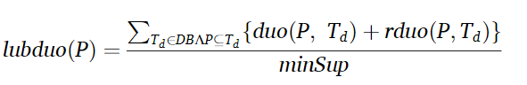
## Định nghĩa 5. (Cận trên của chiếm dụng tiện ích suy giảm – Upper bound damped utility occupancy)

Cận trên của giá trị chiếm dụng tiện ích suy giảm của mẫu **P** được ký hiệu là **ubduo(P)**. Đây là **giá trị chiếm dụng tiện ích tối đa mà P có thể đạt được**, do đó có thể được sử dụng như một chỉ số để cắt tỉa (pruning indicator).

Khi ký hiệu **top⌈minSup⌉** biểu thị việc chọn ra **⌈minSup⌉ giá trị lớn nhất** trong tập các giá trị _(duo + rduo)_, thì **ubduo(P)** được ước lượng như sau:
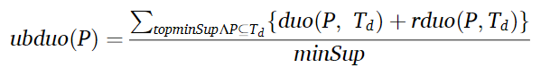

### Giả thuyết 2.
Cận trên của giá trị chiếm dụng tiện ích suy giảm (_upper bound damped utility occupancy_) được sử dụng trong phương pháp được đề xuất **thỏa mãn tính chất phản đơn điệu (anti-monotone)**.

Trong DUOCA được đề xuất, **chiến lược cắt tỉa sử dụng ubduo** mang lại hiệu quả đáng kể cho quá trình mở rộng mẫu. Tuy nhiên, để tính ubduo cho mỗi mẫu, cần phải thực hiện **sắp xếp và duyệt qua** các thông tin của các entry trong một node. Vì vậy, một bước **tiền xử lý nhanh (fast pre-running)** được thực hiện bằng cách sử dụng **Sduo + Srduo** trước khi tính ubduo.

Để trực quan hơn, tổng các giá trị chiếm dụng tiện ích (utility occupancy) ứng với mỗi giao dịch được lưu trong **Sduo** và **Srduo**. Tuy nhiên, **giá trị trung bình** của các utility occupancy theo từng giao dịch **không được tính** ở các bước trước. Vì lý do đó, khi áp dụng chiến lược cắt tỉa dựa trên **Sduo + Srduo**, giá trị **lubduo** thu được bằng cách:
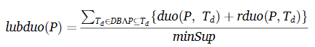

sẽ được so sánh với ngưỡng chiếm dụng tiện ích tối thiểu để xác định xem có cần cắt tỉa mẫu hay không.

Giá trị 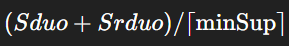 **luôn nhỏ hơn hoặc bằng ubduo**, bởi vì ubduo sử dụng **tổng của ⌈minSup⌉ giá trị lớn nhất** trong tất cả các giá trị _(duo + rduo)_ tại mỗi node rồi chia cho ⌈minSup⌉. Do đó, nếu cận trên dựa trên Sduo và Srduo **nhỏ hơn β** — tức là ngưỡng chiếm dụng tiện ích người dùng đặt — thì mẫu được cắt tỉa **mà không cần tính ubduo**.

Quá trình mở rộng mẫu được thực hiện theo **chiến lược DFS**, kết hợp với các so sánh hai chiều nhằm cấu hình hiệu quả các entry trong mỗi node. Độ dài mẫu được mở rộng bằng cách đệ quy quá trình này.

Trước hết, chiến lược cắt tỉa dựa vào **độ hỗ trợ (support)** được áp dụng. Nếu support của mẫu nhỏ hơn _minSup_, quá trình mở rộng mẫu cho item đó dừng lại và thuật toán chuyển sang mẫu tiếp theo theo thứ tự đã sắp xếp. Ngược lại, thuật toán sẽ kiểm tra chiến lược cắt tỉa sử dụng **lubduo**.

Đồng thời, bằng cách so sánh giá trị **duo của mẫu hiện tại** với β, thuật toán xác định xem mẫu có phải là mẫu kết quả hay không.

Nếu cận trên dựa trên **Sduo + Srduo < β**, quá trình mở rộng bị dừng. Nếu không, chiến lược cắt tỉa dựa vào **ubduo** sẽ được sử dụng. Nếu **ubduo ≥ β**, node của mẫu sẽ được kết hợp với node của các mẫu kế tiếp để tạo ra một _conditional list_ cho mẫu siêu (super-pattern).

Các entry trong hai node trước đó được so sánh để tạo entry mới trong node kết hợp:

- Nếu hai entry có chung **tid**, một entry mới được tạo.
- Giá trị **uo** của entry mới được tính bằng cách kết hợp uo từ hai node và loại bỏ uo liên quan đến tiền tố chung.
- Giá trị **ruo** của entry mới được đặt bằng giá trị nhỏ hơn — cụ thể là **ruo của item xuất hiện sau**.

Trong suốt quá trình tạo entry mới, **duo và ruo** được tính dựa trên các giá trị uo và ruo mới và được cập nhật vào **Sduo** và **Srduo**.

Trong quy trình mở rộng mẫu, các node của mẫu độ dài k sẽ tạo ra các node của mẫu độ dài k+1 cho đến khi không còn danh sách nào có thể kết hợp. Nhờ đó, toàn bộ các node được duyệt qua và các mẫu chiếm dụng tiện ích suy giảm cao được trích xuất **mà không bị bỏ sót**.

## Ví dụ 4.

Ví dụ này mô tả quy trình mở rộng mẫu (pattern expansion) khi sử dụng các mục G và C. **Hình 4** minh họa các ví dụ kết hợp của nhiều mẫu khác nhau cùng với các chiến lược cắt tỉa (pruning).

Ngưỡng **utility occupancy tối thiểu**, ký hiệu **β**, được đặt là **0,6**.

Vì **độ hỗ trợ (support)** của item **G** bằng **4**, nên G không bị cắt tỉa. Tuy nhiên, nó **không được đưa vào tập kết quả** vì giá trị **Sduo của G < β**.

Mặc dù mẫu này không hợp lệ, giá trị **lubduo(G)** — được tính bằng 
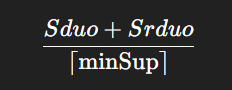
— vẫn được xác định. Cụ thể:
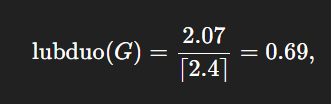
và giá trị này **không nhỏ hơn β**.

Bên cạnh đó, giá trị **ubduo(G) = 0.624** cũng **không nhỏ hơn β**, nên item G được **kết hợp với item C** để tạo ra một node mới. Node tương ứng với mẫu **{GC}** được thêm vào _conditional list_ của các mẫu có độ dài 2.

Tương tự, các node còn lại với tiền tố G được xây dựng theo cùng một cách.

Tiếp theo, thuật toán kết hợp các node của các mẫu độ dài 2 để tạo _conditional list_ của các mẫu độ dài 3, bằng cách ghép hai mẫu độ dài 2 là **{GC}** và **{GF}**. Quy trình giống như trước đó.

Mẫu **{GC}** cũng không bị cắt tỉa vì **ubduo(GC) ≥ β**.

Item **C** cũng không bị cắt tỉa theo tiêu chí ubduo vì:
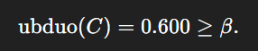
Ngược lại, item **F** bị cắt tỉa theo chiến lược **lubduo pruning**, vì:
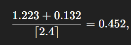
và giá trị này **nhỏ hơn β**.

# 3.7. Algorithm for dynamic analysis of high utility occupancy patterns with damped control

Trong phần này, các thao tác chi tiết của thuật toán được đề xuất được trình bày. 

Trong **Thuật toán 1**, luồng dữ liệu động, hệ số suy giảm và các ngưỡng được sử dụng làm giá trị đầu vào. Để tính _minSup_, số lượng giao dịch trong dữ liệu đã quét được xác định. Vì vậy, **dbSize**, biểu thị quy mô dữ liệu, được khởi tạo bằng 0 (Dòng 01). Dữ liệu gốc và dữ liệu bổ sung được đọc tuần tự (Dòng 02–11). Dữ liệu được quét được xử lý riêng cho từng giao dịch (Dòng 03–05). Dựa trên các giao dịch này, các _global list_ được xây dựng (Dòng 04).

Để tính toán giá trị chiếm dụng tiện ích suy giảm, thuật toán quản lý **TID cuối cùng** của các giao dịch đã quét (Dòng 05). Sau đó, kích thước dữ liệu và _minSup_ được cập nhật (Dòng 06–07). Nếu người dùng yêu cầu tìm kết quả, quy trình **Restructure** sẽ được thực hiện nhằm tái cấu trúc _global DUOCA-List_, và sau đó **Expansion** được áp dụng lên danh sách đã tái cấu trúc (Dòng 08–10). Cuối cùng, các mẫu kết quả được trả về cho người dùng (Dòng 11).

---

**Thuật toán 2** mô tả quy trình con tái cấu trúc _global list_. Các danh sách DUOCA toàn cục và TID cuối cùng được truyền vào như tham số, và kết quả trả về là _global list_ đã tái cấu trúc.

---

**Thuật toán 3** mô tả quy trình trích xuất các mẫu chiếm dụng tiện ích suy giảm cao. Trong quá trình mở rộng (Expansion), phương pháp được đề xuất nhận một DUOCA-list và một mẫu tiền tố. Quy trình này được thực thi **đệ quy**, và tất cả các mẫu được trích xuất **không bị mất mát hoặc trùng lặp**.

Tập kết quả HUOP được khởi tạo ban đầu (Dòng 01). Các danh sách trong cấp hiện tại được duyệt lần lượt (Dòng 02–15). Việc mở rộng mẫu tiếp tục nếu **support của danh sách hiện tại ≥ minSup** (Dòng 03–04).

Nếu **Sduo của Ci chia cho support của Ci ≥ β**, thì mẫu ứng với Ci sẽ được kết hợp với mẫu tiền tố và đưa vào HUOP (Dòng 05–06).

Sau đó, hai chiến lược cắt tỉa **lubduo** và **ubduo** được áp dụng (Dòng 07). Khi cả hai điều kiện cắt tỉa đều thỏa mãn, **danh sách điều kiện cấp tiếp theo (NCL)** được tạo ra (Dòng 08).

Trong bước này, hai danh sách **Ci và Cj** được kết hợp nhằm tạo ra entry mới cũng như cấu hình lại **Sduo** và **Srduo** cho node của mẫu mở rộng (Dòng 09–12). Nếu việc kết hợp mẫu hoàn tất, node kết quả được thêm vào NCL (Dòng 11–12).

Nếu NCL chứa từ hai node trở lên, **Expansion được gọi đệ quy** (Dòng 13–14). Khi quá trình mở rộng không còn được gọi đệ quy nữa, các mẫu kết quả được trả về (Dòng 15).

# 3.8. Computational complexity analysis of DUOCA
Trong phần tiếp theo, phân tích về độ phức tạp tính toán của DUOCA được trình bày. Phân tích bao gồm việc so sánh độ phức tạp giữa thuật toán được đề xuất, DUOCA, và phương pháp phân tích mẫu chiếm dụng tiện ích cao trong môi trường động hiện đại nhất, HUOMI [45], vốn cũng sử dụng cấu trúc danh sách.

Trong phân tích này, giả sử cả hai phương pháp đều thực hiện trích xuất mẫu trên dữ liệu có các đặc điểm sau: số lượng giao dịch là **m**, số lượng mục phân biệt là **n**, và độ dài trung bình của mỗi giao dịch là **k**. Ngoài ra, giả sử việc đọc và ghi mỗi mục có chi phí **O(1)**.

Cả hai phương pháp đều thực hiện các bước: xây dựng (hoặc cập nhật) danh sách, tính toán thứ tự sắp xếp, tái cấu trúc, và mở rộng mẫu để trích xuất các mẫu kết quả.

### **1. Giai đoạn xây dựng (constructing/updating)**
Vì cả hai thuật toán xử lý cùng một dữ liệu, chúng cần quét **m × k** mục, dẫn đến độ phức tạp: O(mk)
### **2. Giai đoạn tính toán thứ tự sắp xếp**
Để tính thứ tự sắp xếp của _global list_, cả hai cần so sánh giá trị hỗ trợ của các mục phân biệt. Giai đoạn này có độ phức tạp: **O(n log⁡ n)**
### **3. Giai đoạn tái cấu trúc (restructuring)**
Quy trình tái cấu trúc cần thực hiện các thao tác đọc, sắp xếp và ghi cho mỗi giao dịch, với chi phí: **O(2k+k log k)**

Đối với toàn bộ dữ liệu: **O(2mk+mk log⁡ k)**

Tại thời điểm này, hai thuật toán có độ phức tạp **bằng nhau** từ bước đầu cho đến kết thúc giai đoạn tái cấu trúc.

### **4. Giai đoạn mở rộng mẫu (pattern expansion) — phần quyết định độ phức tạp**

Đây là phần chiếm tỷ trọng lớn nhất trong toàn bộ quy trình trích xuất mẫu, và là phần tạo ra sự khác biệt về độ phức tạp giữa hai thuật toán.

Chi phí của giai đoạn mở rộng mẫu **tỷ lệ thuận với kích thước không gian tìm kiếm**, tức là số lượng mẫu có thể mở rộng sau khi đã áp dụng cắt tỉa.

Ta ký hiệu:

- **CntAll(S)**: tổng số mẫu có thể mở rộng
- **CntD(S, f)**: số mẫu bị cắt tỉa bởi DUOCA
- **CntH(S)**: số mẫu bị cắt tỉa bởi HUOMI
- S biểu thị thiết lập dữ liệu và hai ngưỡng
- Các cận trên tìm kiếm:
    - **ubduo(X)** trong DUOCA
    - **ubuo(X)** trong HUOMI

Công thức của **ubuo(X)** là:
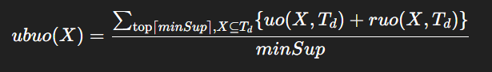

Khi so sánh phương trình (9) và (12), ta có:
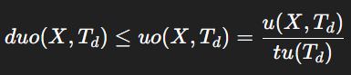

Điều này luôn đúng vì **f thuộc (0, 1)**. Do đó:
→ **ubduo(X)** là một **cận trên chặt hơn** so với **ubuo(X)**.

Điều này dẫn đến:

nghĩa là DUOCA **cắt tỉa nhiều mẫu hơn**, giúp thu hẹp không gian tìm kiếm hiệu quả hơn so với HUOMI.

Hơn nữa, **CntD(S,f) tăng lên khi f giảm** (vì hệ số suy giảm nhỏ làm giảm duo, giảm ubduo, nên nhiều mẫu bị loại bỏ hơn). Điều này làm cho sự khác biệt giữa DUOCA và HUOMI càng trở nên lớn.

Kết quả là:

tức là **không gian tìm kiếm còn lại của DUOCA luôn nhỏ hơn HUOMI**.
### **Kết luận**

**DUOCA có độ phức tạp tính toán tốt hơn đáng kể so với HUOMI**, nhờ cận trên ubduo chặt hơn và chiến lược cắt tỉa hiệu quả hơn trong quá trình mở rộng mẫu.