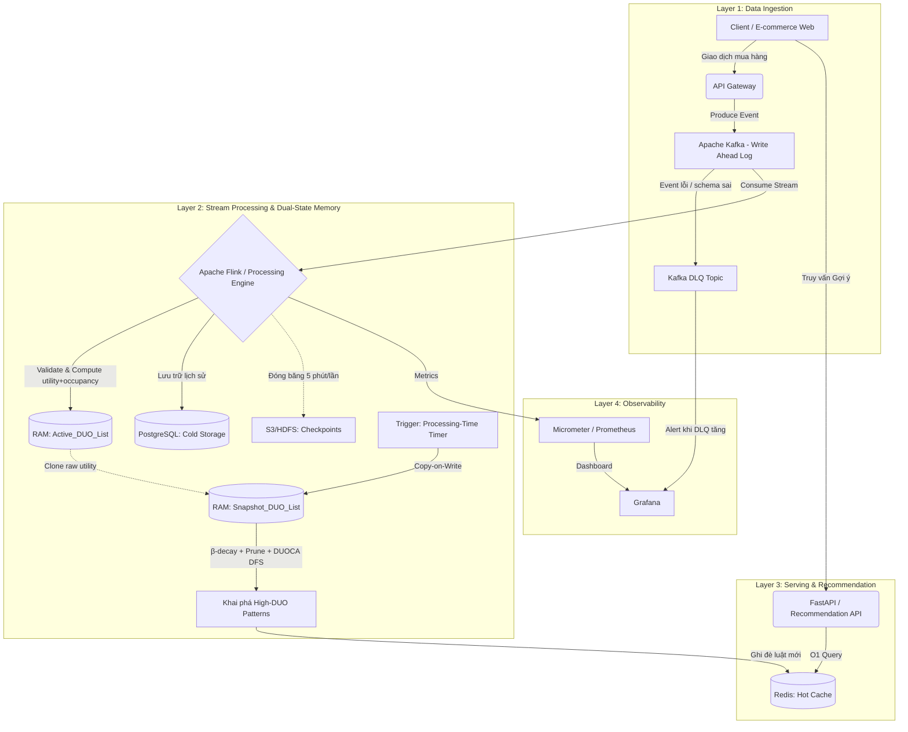

# TÀI LIỆU THIẾT KẾ KIẾN TRÚC HỆ THỐNG KHUYẾN NGHỊ THỜI GIAN THỰC DÙNG DUOCA

## 1. Mục tiêu và phạm vi

Hệ thống được thiết kế để xử lý luồng giao dịch bán lẻ tốc độ cao và tạo khuyến nghị sản phẩm theo thời gian thực bằng thuật toán DUOCA (Damped Utility Occupancy).

Mục tiêu cốt lõi:

1. Tránh xung đột đọc/ghi khi vừa nhận dữ liệu mới vừa khai phá mẫu.
2. Kiểm soát bộ nhớ RAM trong bối cảnh dữ liệu vào liên tục 24/7.
3. Bảo đảm khả năng phục hồi sau sự cố mà không mất dữ liệu.
4. Phục vụ truy vấn gợi ý với độ trễ thấp ở tầng API.

Phạm vi tài liệu tập trung vào kiến trúc xử lý luồng, quản lý trạng thái DUO, cơ chế khai phá mẫu và luồng phục vụ khuyến nghị.

## 2. Nguyên tắc kiến trúc

Kiến trúc tuân theo 3 nguyên tắc:

1. Event-driven: mọi giao dịch đi qua luồng sự kiện để tách producer/consumer.
2. CQRS theo ngữ cảnh thực thi: đường ghi tối ưu thông lượng và đường đọc tối ưu độ trễ.
3. Dual-state in-memory: tách trạng thái nhận dữ liệu và trạng thái phân tích để loại bỏ lock nặng.

## 3. Kiến trúc tổng thể



## 4. Vai trò từng tầng và cách giải quyết bài toán

### 4.1. Tầng thu thập dữ liệu chống mất mát

- Thành phần: Kafka (2 topic: `transactions` và `transactions-dlq`).
- Vai trò: làm write-ahead log cho toàn bộ sự kiện trước khi vào xử lý RAM.
- Giá trị: nếu cụm xử lý bị dừng đột ngột, hệ thống có thể đọc lại từ offset gần nhất để tiếp tục.
- **Dead Letter Queue (DLQ)**: event không đúng schema hoặc bị lỗi validation được chuyển sang topic `transactions-dlq` thay vì drop hoặc block pipeline. Đây là đảm bảo an toàn cho production.
- **Schema Registry**: sử dụng Confluent Schema Registry kèm Avro/Protobuf để quản lý schema evolution, ngăn lỗi deserialize khi schema thay đổi.

### 4.2. Tầng xử lý luồng với trạng thái kép

- Thành phần: Apache Flink (DataStream API Java) + state trên RAM.
- Trạng thái 1: Active_DUO_List luôn mở để cập nhật giao dịch mới.
- Trạng thái 2: Snapshot_DUO_List được tạo bằng copy-on-write khi đến chu kỳ khai phá.
- Giá trị: tiến trình khai phá chạy trên snapshot nên không khóa đường ingest; phần thuật toán DUOCA lõi được hiện thực bằng Java để tối ưu hiệu năng CPU/bộ nhớ.

### 4.3. Tầng an toàn bộ nhớ và bền vững dữ liệu

- Memory pruning: áp dụng hệ số suy hao và ngưỡng min_duo để loại bỏ node ít giá trị khỏi RAM.
- Checkpointing: chụp trạng thái Active_DUO_List định kỳ 5 phút lên S3/HDFS.
- Cold storage: đồng thời ghi giao dịch gốc vào PostgreSQL cho báo cáo, đối soát, kiểm toán.

### 4.4. Tầng phục vụ khuyến nghị độ trễ thấp

- Thành phần: Redis + FastAPI.
- Vai trò: lưu kết quả mẫu/luật gợi ý ở Redis, API chỉ đọc và trả nhanh cho frontend.
- Mục tiêu vận hành: độ trễ truy vấn gợi ý dưới 10 ms trong điều kiện tải bình thường.

## 5. Luồng xử lý end-to-end

1. Người dùng phát sinh giao dịch (ví dụ mua tập sản phẩm $\{A, B\}$).
2. Frontend gửi sự kiện qua API Gateway và được ghi vào Kafka.
3. Flink consume sự kiện, cập nhật Active_DUO_List và ghi giao dịch gốc vào PostgreSQL.
4. Theo chu kỳ (ví dụ mỗi 1 phút), hệ thống tạo Snapshot_DUO_List từ Active_DUO_List.
5. Trên snapshot, hệ thống áp dụng suy hao và chạy DUOCA DFS để tìm mẫu thỏa ngưỡng.
6. Kết quả mẫu có giá trị được ghi sang Redis dưới dạng dữ liệu phục vụ gợi ý.
7. FastAPI truy vấn Redis để trả kết quả gợi ý theo thời gian thực cho client.
8. Song song, tiến trình pruning và checkpoint chạy định kỳ để giữ RAM ổn định và bảo đảm phục hồi.

## 6. Quy trình thuật toán DUOCA trong hệ thống

### 6.0. Định nghĩa toán học nền tảng

Đây là các khái niệm toán học từ bài báo DUOCA cần hiểu thống nhất trước khi implement:

**Utility của item $i$ trong giao dịch $T$:**
$$u(i, T) = profit(i) \times quantity(i, T)$$

**Utility của toàn bộ giao dịch $T$:**
$$u(T) = \sum_{i \in T} u(i, T)$$

**Utility Occupancy của tập mẫu $P$ trong giao dịch $T$:**
$$uo(P, T) = \frac{\sum_{i \in P} u(i, T)}{u(T)}$$

> Ý nghĩa: $uo(P, T)$ là tỷ lệ đóng góp của tập $P$ vào tổng giá trị của giao dịch $T$. Giá trị thuộc $[0, 1]$.

**Hàm suy hao (Damping Factor):**
$$damped\_uo(P, T_d) = uo(P, T_d) \times \beta^{\Delta t}$$

Trong đó:
- $\beta \in (0, 1)$ là hệ số suy hao (trong code đặt tên là `f`, tương ứng với $\beta$ trong bài báo).
- $\Delta t = t_{current} - t_{T_d}$ là khoảng cách thời gian (đơn vị: window/batch, không phải giây) giữa giao dịch $T_d$ và thời điểm hiện tại.
- Giao dịch cũ hơn sẽ có $\Delta t$ lớn hơn, dẫn đến $\beta^{\Delta t}$ nhỏ hơn → ảnh hưởng ít hơn.

> **Lưu ý quan trọng**: `f` trong tài liệu này tương đương với `β` trong bài báo gốc. Đây là hàm mũ theo thời gian, KHÔNG phải nhân thẳng. Lập trình viên phải implement đúng: $f^{\Delta t}$, không phải $f \times \Delta t$.

**Damped Utility Occupancy (DUO) tổng hợp của tập P:**
$$duo(P) = \sum_{T_d \in DB: P \subseteq T_d} damped\_uo(P, T_d)$$

**Remaining Utility Occupancy (RUO) — dùng tính upper bound:**
$$ruo(P, T_d) = \frac{\sum_{i \in T_d \setminus P} u(i, T_d)}{u(T_d)} \times \beta^{\Delta t}$$

> $ruo$ là phần utility occupancy còn lại của các item CHƯA thuộc $P$ trong cùng giao dịch $T_d$. Dùng để tính `ubduo` (upper bound) nhằm cắt tỉa nhánh DFS sớm.

**Ngưỡng lọc mẫu — hai điều kiện PHẢI thỏa đồng thời:**
1. $duo(P) \geq min\_duo$ — tổng damped utility occupancy đủ lớn.
2. $occ(P) \geq min\_occ$ — tần suất xuất hiện (số giao dịch chứa $P$) đủ cao.

**Ví dụ minh họa:**

| Thông số | Giá trị |
|---|---|
| Giao dịch | $T = \{A: 2, B: 3, C: 1\}$ |
| Đơn giá lợi nhuận | $profit = \{A: 5, B: 3, C: 10\}$ |
| $u(A, T)$ | $2 \times 5 = 10$ |
| $u(B, T)$ | $3 \times 3 = 9$ |
| $u(C, T)$ | $1 \times 10 = 10$ |
| $u(T)$ | $10 + 9 + 10 = 29$ |
| $uo(\{A,B\}, T)$ | $(10 + 9) / 29 \approx 0.655$ |
| $ruo(\{A,B\}, T)$ | $10 / 29 \approx 0.345$ |
| $damped\_uo$ ($\beta=0.9$, $\Delta t=2$) | $0.655 \times 0.9^2 \approx 0.530$ |

---

### 6.1. Construction Procedure trên Active_DUO_List

1. Đọc giao dịch mới $T_d$ gồm danh sách item và số lượng.
2. Tính $u(i, T_d)$ cho từng item: $profit(i) \times quantity(i, T_d)$.
3. Tính $u(T_d)$ = tổng utility toàn giao dịch.
4. Với từng item $i \in T_d$: tính $uo(i, T_d) = u(i, T_d) / u(T_d)$ và $ruo(i, T_d) = (u(T_d) - u(i, T_d)) / u(T_d)$.
5. Tạo/cập nhật `DuoNode` trong Active_DUO_List với đầy đủ: `tid`, `uo` (raw, chưa suy hao), `ruo` (raw), `timestamp` (thời điểm giao dịch).

> **Lưu ý**: Active_DUO_List lưu `uo` và `ruo` **raw (chưa suy hao)**. Suy hao chỉ được áp dụng khi tạo Snapshot để đảm bảo snapshot phản ánh đúng khoảng cách thời gian tại thời điểm mining.

### 6.2. Restructure Procedure trên Snapshot_DUO_List

1. Khi có trigger (processing-time timer), tạo snapshot từ active state bằng copy-on-write.
2. Với mỗi `DuoNode`, tính $\Delta t = t_{snapshot} - t_{transaction}$ (đơn vị window).
3. Áp dụng suy hao: $damped\_uo = uo_{raw} \times \beta^{\Delta t}$ và $damped\_ruo = ruo_{raw} \times \beta^{\Delta t}$.
4. Tính $duo$ tổng cho từng item: cộng $damped\_uo$ qua tất cả transaction chứa item đó.
5. Prune sơ bộ: loại item có $duo < min\_duo$ (không thể thỏa ngưỡng kể cả khi mở rộng thêm item).
6. Sắp xếp danh sách còn lại theo `duo` tăng dần để tối ưu thứ tự mở rộng DFS.

### 6.3. Pattern Expansion Procedure bằng DFS

1. Mở rộng từ item đơn sang tập mẫu (ví dụ từ $A$ và $B$ thành $P=\{A,B\}$).
2. Tạo DUO-list cho mẫu mới bằng phép giao (inner join) các DUO-list thành phần theo `tid`.
3. Tính:
   - $duo(P) = \sum damped\_uo(P, T_d)$ — giá trị thực của mẫu.
   - $ubduo(P) = duo(P) + \sum damped\_ruo(P, T_d)$ — upper bound thứ nhất.
   - $lubduo(P)$ — upper bound thứ hai dựa trên tập con item (local upper bound).
4. **Điều kiện xác nhận mẫu** (phải thỏa CẢ HAI):
   - $duo(P) \geq min\_duo$ → mẫu có đủ utility occupancy.
   - $occ(P) \geq min\_occ$ → mẫu xuất hiện đủ thường xuyên.
   - Nếu thỏa: xác nhận là High DUO Pattern và ghi sang Redis.
5. **Điều kiện cắt tỉa** (dừng mở rộng nhánh nếu một trong hai):
   - $ubduo(P) < min\_duo$ → không có itemset con nào của $P$ có thể thỏa ngưỡng.
   - $lubduo(P) < min\_duo$ → cắt tỉa cục bộ nhánh hiện tại.

## 7. Nhóm tính năng theo miền nghiệp vụ

### 7.1. Frontend và trải nghiệm khách hàng

- Ghi nhận sự kiện tương tác theo thời gian thực (add to cart, checkout).
- Hiển thị danh sách gợi ý như frequently bought together hoặc you may also like.
- Cập nhật gợi ý động trên giao diện mà không cần tải lại toàn trang.

### 7.2. Ingestion và phân phối dữ liệu

- Tiếp nhận đồng thời cao ở API Gateway trong các đợt cao điểm.
- Đệm và xếp hàng sự kiện qua Kafka để chống nghẽn và chống mất dữ liệu.

### 7.3. Khai phá mẫu và xử lý lõi

- Tính utility và utility occupancy liên tục theo luồng giao dịch.
- Duy trì dual-state để tách ingest path và mining path.
- Áp dụng damped window, pruning và checkpoint theo chu kỳ.

### 7.4. Serving và quản trị vận hành

- Cung cấp API gợi ý độ trễ thấp dựa trên Redis.
- Lưu trữ lịch sử giao dịch ở PostgreSQL cho nhu cầu phi thời gian thực.
- Theo dõi throughput, memory usage, checkpoint health và latency toàn pipeline.

## 8. Chỉ tiêu phi chức năng và vận hành

Các chỉ tiêu nên được theo dõi như KPI kỹ thuật:

1. End-to-end latency từ lúc phát sinh giao dịch đến lúc luật gợi ý được cập nhật.
2. API recommendation latency tại percentile P95/P99.
3. Throughput ingest và throughput processing theo giây/phút.
4. Tỷ lệ sử dụng RAM của state và hiệu quả pruning.
5. Recovery time objective khi khôi phục từ checkpoint + Kafka offset.

Các cấu hình chính có thể tinh chỉnh theo tải thực tế:

- Chu kỳ mining (ví dụ 1 phút).
- Chu kỳ checkpoint (ví dụ 5 phút).
- Hệ số suy hao $f$.
- Ngưỡng min_duo.

## 9. Công nghệ triển khai code lõi bằng Java

Để đáp ứng yêu cầu viết thuật toán chính bằng Java, tầng xử lý DUOCA sử dụng stack sau:

1. Ngôn ngữ và runtime: Java 21 (LTS).
2. Stream engine: Apache Flink 1.19+, viết job bằng Java DataStream API.
3. Serialization: Avro hoặc Protobuf cho sự kiện Kafka.
4. Build tool: Maven (khuyến nghị) hoặc Gradle.
5. Test: JUnit 5 + Testcontainers (Kafka/Flink integration test).
6. Quan sát hệ thống: Micrometer + Prometheus/Grafana.

### 9.1. Phân tách module mã nguồn Java

- module ingestion:
  - Kafka consumer/decoder cho giao dịch.
  - Chuẩn hóa dữ liệu thành TransactionEvent.
- module duo-state:
  - Quản lý Active_DUO_List và Snapshot_DUO_List.
  - Cung cấp thao tác copy-on-write và prune.
- module duo-mining:
  - Construction, Restructure, DFS Pattern Expansion.
  - Tính duo, ubduo, lubduo.
- module serving-writer:
  - Ghi kết quả mẫu sang Redis.
  - Ghi cold data sang PostgreSQL.
- module ops:
  - Cấu hình checkpoint, watermark, metric, retry.

### 9.2. Thiết kế class lõi (gợi ý)

**TransactionEvent** — biểu diễn giao dịch đầu vào:
```
TransactionEvent {
  String transactionId
  long   timestamp          // epoch millis
  Map<String, Integer> itemQuantities  // itemId -> quantity
  Map<String, Double>  itemProfits     // itemId -> unit profit
}
```

**DuoNode** — đơn vị lưu trữ trong DUO-list của một item/mẫu:
```
DuoNode {
  String tid              // transaction id
  long   timestamp        // thời điểm giao dịch (dùng tính Δt)
  double uo               // utility occupancy raw (chưa suy hao)
  double ruo              // remaining utility occupancy raw (chưa suy hao)
  // Sau khi snapshot:
  // damped_uo  = uo  × β^Δt
  // damped_ruo = ruo × β^Δt
}
```

**HighDuoPattern** — kết quả mẫu hợp lệ ghi sang Redis:
```
HighDuoPattern {
  Set<String> itemset     // tập item của mẫu
  double duo              // damped utility occupancy tổng
  int    occurrences      // số giao dịch chứa mẫu
  long   discoveredAt     // timestamp khai phá
}
```

**Các class service:**
- `ActiveDuoStateStore`: cập nhật state nóng theo luồng sự kiện, lưu raw uo/ruo.
- `SnapshotBuilder`: tạo snapshot copy-on-write theo processing-time trigger.
- `DampingService`: áp dụng $\beta^{\Delta t}$ lên từng DuoNode trong snapshot. Nhận tham số `beta` (0 < beta < 1) từ config runtime.
- `PruningService`: cắt tỉa theo `min_duo` **VÀ** `min_occ` — hai điều kiện độc lập.
- `OccupancyCalculator`: tính $uo(P, T)$ và $ruo(P, T)$ từ raw utility values.
- `DuoMinerDFS`: mở rộng mẫu, tính duo/ubduo/lubduo, quyết định confirm hoặc prune.
- `RecommendationSink`: ghi `HighDuoPattern` hợp lệ vào Redis dưới dạng Hash/Sorted Set.
- `DlqHandler`: xử lý event lỗi từ DLQ topic để log, alert hoặc retry.

### 9.3. Luồng chạy job Java trong Flink

1. **Source** đọc event từ Kafka topic `transactions` (Avro/Protobuf, kèm Schema Registry).
2. **Operator: SchemaValidator** — kiểm tra schema và giá trị hợp lệ (quantity > 0, profit > 0). Event lỗi được route sang Kafka topic `transactions-dlq`.
3. **Operator: UtilityCalculator** — tính $u(i, T)$ cho từng item, tính $u(T)$ tổng, tính $uo(i, T)$ và $ruo(i, T)$ (raw, chưa suy hao).
4. **Operator: ActiveStateUpdater** — cập nhật `Active_DUO_List` với DuoNode mới (lưu raw values + timestamp).
5. **Processing-Time Trigger** (mỗi `mining_interval`, mặc định 1 phút) kích hoạt `SnapshotBuilder`.
6. **Operator: DuoMiningOperator**:
   a. Clone snapshot bằng copy-on-write.
   b. Gọi `DampingService` áp dụng $\beta^{\Delta t}$ lên toàn snapshot.
   c. Gọi `PruningService` loại item có $duo < min\_duo$ hoặc $occ < min\_occ$.
   d. Gọi `DuoMinerDFS` mở rộng và xác nhận High DUO Patterns.
7. **Sink 1**: `RecommendationSink` ghi `HighDuoPattern` vào Redis (TTL = 2 × mining_interval).
8. **Sink 2**: `PostgreSQLSink` ghi raw transaction vào PostgreSQL cho audit/báo cáo.
9. **Flink Checkpoint** định kỳ (mỗi `checkpoint_interval`, mặc định 5 phút) lưu state lên S3/HDFS.
10. **Sink 3**: `MetricsSink` emit metrics (throughput, DUO memory, mining latency) sang Prometheus.

### 9.4. Quy ước hiệu năng khi hiện thực Java

- Ưu tiên primitive collections hoặc cấu trúc dữ liệu giảm boxing/unboxing.
- Hạn chế cấp phát object trong vòng lặp DFS nóng; tái sử dụng buffer khi có thể.
- Dùng keyBy hợp lý để tránh skew partition trong Flink.
- Tách ngưỡng `min_duo`, `min_occ` và hệ số $\beta$ (`f`) thành config runtime để dễ tuning.
- `DampingService` phải dùng hàm mũ $\beta^{\Delta t}$ — không dùng phép nhân tuyến tính.
- Tính $\Delta t$ theo đơn vị window (số lần mining cycle) thay vì milliseconds để tránh float overflow với dữ liệu lớn.

### 9.5. Khuyến nghị triển khai giai đoạn đầu

1. Giai đoạn 1: hoàn thiện DuoMinerDFS và unit test trên dữ liệu nhỏ.
2. Giai đoạn 2: tích hợp Flink state + checkpoint + Kafka source.
3. Giai đoạn 3: nối Redis/PostgreSQL sink và đo KPI P95/P99.
4. Giai đoạn 4: tối ưu hotspot (CPU, GC, memory) bằng profiler.

---

## 10. Xử lý lỗi và khả năng quan sát (Resilience & Observability)

### 10.1. Dead Letter Queue (DLQ)

Mọi event không qua được bước validation đều được route sang topic `transactions-dlq` thay vì bị drop hoặc làm block pipeline.

| Loại lỗi | Xử lý |
|---|---|
| Schema không khớp (Avro/Protobuf parse lỗi) | Route sang DLQ ngay tại Source |
| Giá trị bất hợp lệ (quantity ≤ 0, profit < 0) | Route sang DLQ tại SchemaValidator |
| Lỗi xử lý trong Operator (exception) | Retry 3 lần → route sang DLQ |
| DLQ consumer | Service riêng đọc DLQ, log lỗi, gửi alert Slack/email |

**Cấu hình Kafka DLQ:**
- Topic: `transactions-dlq`
- Retention: 7 ngày (để debug thủ công)
- Partition: bằng topic chính để đảm bảo thứ tự tương đối

### 10.2. Schema Registry

- Sử dụng **Confluent Schema Registry** (hoặc AWS Glue Schema Registry nếu dùng AWS).
- Producer (API Gateway) đăng ký schema khi khởi động.
- Consumer (Flink) validate schema qua registry trước khi deserialize.
- Hỗ trợ **backward compatibility**: consumer cũ đọc được schema mới nếu chỉ thêm trường optional.

### 10.3. Observability Stack

**Metrics quan trọng cần expose qua Micrometer → Prometheus:**

| Metric | Ý nghĩa | Ngưỡng cảnh báo |
|---|---|---|
| `flink.ingest.throughput` | Số event/giây đi vào | < 80% baseline → warn |
| `flink.duo.active_nodes` | Số node trong Active_DUO_List | > 80% RAM limit → warn |
| `flink.mining.duration_ms` | Thời gian chạy DUOCA DFS mỗi chu kỳ | > mining_interval → critical |
| `flink.mining.patterns_found` | Số mẫu hợp lệ mỗi chu kỳ | = 0 liên tiếp 3 lần → warn |
| `flink.checkpoint.duration_ms` | Thời gian checkpoint | > 60s → warn |
| `redis.recommendation.latency_p99` | P99 latency query Redis | > 10ms → critical |
| `kafka.dlq.message_count` | Số event lỗi trong DLQ | > 0 trong 5 phút → warn |
| `flink.damping.beta` | Giá trị β hiện tại (config) | Thay đổi đột ngột → alert |

**Dashboard Grafana** nên có các panel:
1. Ingest throughput vs Mining latency (time-series).
2. Active DUO List size (RAM usage % theo thời gian).
3. Số pattern tìm được mỗi chu kỳ mining.
4. DLQ event count (nên luôn = 0 trong trạng thái bình thường).
5. Checkpoint success rate.
6. API recommendation latency P50/P95/P99.

### 10.4. Cấu hình tham số hệ thống (Config Reference)

| Tham số | Tên biến | Giá trị mặc định | Ghi chú |
|---|---|---|---|
| Hệ số suy hao | `duoca.beta` | `0.9` | $\beta \in (0,1)$; phải là hàm mũ theo $\Delta t$ |
| Ngưỡng utility occupancy | `duoca.min_duo` | `0.01` | Điều chỉnh theo mật độ dữ liệu |
| Ngưỡng tần suất | `duoca.min_occ` | `2` | Số giao dịch tối thiểu chứa mẫu |
| Chu kỳ mining | `duoca.mining_interval_sec` | `60` | Đơn vị giây |
| Chu kỳ checkpoint | `duoca.checkpoint_interval_sec` | `300` | Đơn vị giây |
| TTL kết quả Redis | `duoca.redis_ttl_sec` | `120` | = 2 × mining_interval |
| Đơn vị Δt | `duoca.delta_t_unit` | `WINDOW` | Đếm theo số mining cycle, không phải giây |
