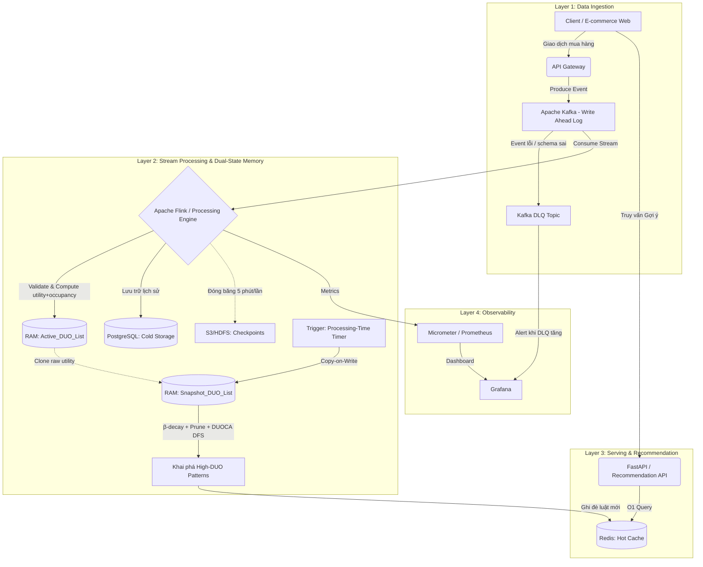

# TÀI LIỆU THIẾT KẾ KIẾN TRÚC HỆ THỐNG KHUYẾN NGHỊ THỜI GIAN THỰC DÙNG DUOCA

## 1. Mục tiêu và phạm vi

Hệ thống được thiết kế để xử lý luồng giao dịch bán lẻ tốc độ cao và tạo khuyến nghị sản phẩm theo thời gian thực bằng thuật toán DUOCA (Damped Utility Occupancy).

Mục tiêu cốt lõi:

1. Tránh xung đột đọc/ghi khi vừa nhận dữ liệu mới vừa khai phá mẫu.
2. Kiểm soát bộ nhớ RAM trong bối cảnh dữ liệu vào liên tục 24/7.
3. Bảo đảm khả năng phục hồi sau sự cố mà không mất dữ liệu.
4. Phục vụ truy vấn gợi ý với độ trễ thấp ở tầng API.

Phạm vi tài liệu tập trung vào kiến trúc xử lý luồng, quản lý trạng thái DUO, cơ chế khai phá mẫu và luồng phục vụ khuyến nghị.

## 2. Nguyên tắc kiến trúc

Kiến trúc tuân theo 3 nguyên tắc:

1. Event-driven: mọi giao dịch đi qua luồng sự kiện để tách producer/consumer.
2. CQRS theo ngữ cảnh thực thi: đường ghi tối ưu thông lượng và đường đọc tối ưu độ trễ.
3. Dual-state in-memory: tách trạng thái nhận dữ liệu và trạng thái phân tích để loại bỏ lock nặng.

## 3. Kiến trúc tổng thể



## 4. Vai trò từng tầng và cách giải quyết bài toán

### 4.1. Tầng thu thập dữ liệu chống mất mát

- Thành phần: Kafka (2 topic: `transactions` và `transactions-dlq`).
- Vai trò: làm write-ahead log cho toàn bộ sự kiện trước khi vào xử lý RAM.
- Giá trị: nếu cụm xử lý bị dừng đột ngột, hệ thống có thể đọc lại từ offset gần nhất để tiếp tục.
- **Dead Letter Queue (DLQ)**: event không đúng schema hoặc bị lỗi validation được chuyển sang topic `transactions-dlq` thay vì drop hoặc block pipeline. Đây là đảm bảo an toàn cho production.
- **Schema Registry**: sử dụng Confluent Schema Registry kèm Avro/Protobuf để quản lý schema evolution, ngăn lỗi deserialize khi schema thay đổi.

### 4.2. Tầng xử lý luồng với trạng thái kép

- Thành phần: Apache Flink (DataStream API Java) + state trên RAM/SSD.
- Trạng thái 1: **Active_DUO_List** — luôn mở để cập nhật giao dịch mới. **Tuyệt đối không xóa node** khỏi danh sách này (bài báo: *"maintained without any deletion throughout the entire process"*).
- Trạng thái 2: **Snapshot_DUO_List** — bản sao tạm, được tạo bằng copy-on-write khi đến chu kỳ khai phá. Chỉ pruning trên bản này.
- Giá trị: tiến trình khai phá chạy trên snapshot nên không khóa đường ingest; phần thuật toán DUOCA lõi được hiện thực bằng Java để tối ưu hiệu năng CPU/bộ nhớ.

### 4.3. Tầng an toàn bộ nhớ và bền vững dữ liệu

- **Tiered Storage (KHÔNG xóa node khỏi Active_DUO_List)**: Flink sử dụng `RocksDB StateBackend` để tự động đẩy DuoNode "lạnh" (ít được truy cập) xuống SSD local, giữ DuoNode "nóng" trên RAM heap. Đây là cơ chế đúng để kiểm soát RAM mà không vi phạm tính toàn vẹn lịch sử dữ liệu. State TTL của Flink có thể đặt rất dài (ví dụ 90 ngày) chỉ để tránh rò rỉ data vĩnh viễn, không dùng để pruning chủ động.
- **Snapshot Pruning (CHỈ trên bản sao)**: Pruning theo `min_duo` và `minSup` chỉ diễn ra trên `Snapshot_DUO_List` — một bản sao tạm phục vụ thuật toán DFS. Dữ liệu bị loại khỏi snapshot **không bị xóa** khỏi `Active_DUO_List`.
- **Checkpointing**: chụp trạng thái `Active_DUO_List` + `StreamCounterState` định kỳ 5 phút lên S3/HDFS.
- **Cold storage**: đồng thời ghi giao dịch gốc vào PostgreSQL cho báo cáo, đối soát, kiểm toán.

### 4.4. Tầng phục vụ khuyến nghị độ trễ thấp

- Thành phần: Redis + FastAPI.
- Vai trò: lưu kết quả mẫu/luật gợi ý ở Redis, API chỉ đọc và trả nhanh cho frontend.
- Mục tiêu vận hành: độ trễ truy vấn gợi ý dưới 10 ms trong điều kiện tải bình thường.

## 5. Luồng xử lý end-to-end

1. Người dùng phát sinh giao dịch (ví dụ mua tập sản phẩm $\{A, B\}$).
2. Frontend gửi sự kiện qua API Gateway và được ghi vào Kafka.
3. Flink consume sự kiện, cập nhật Active_DUO_List và ghi giao dịch gốc vào PostgreSQL.
4. Theo chu kỳ (ví dụ mỗi 1 phút), hệ thống tạo Snapshot_DUO_List từ Active_DUO_List.
5. Trên snapshot, hệ thống áp dụng suy hao và chạy DUOCA DFS để tìm mẫu thỏa ngưỡng.
6. Kết quả mẫu có giá trị được ghi sang Redis dưới dạng dữ liệu phục vụ gợi ý.
7. FastAPI truy vấn Redis để trả kết quả gợi ý theo thời gian thực cho client.
8. Song song, RocksDB tự động quản lý phân tầng RAM↔SSD; checkpoint định kỳ để bảo đảm phục hồi. Không có tiến trình tự ý xóa node khỏi Active_DUO_List.

## 6. Quy trình thuật toán DUOCA trong hệ thống

### 6.0. Định nghĩa toán học nền tảng

Đây là các khái niệm toán học từ bài báo DUOCA cần hiểu thống nhất trước khi implement:

**Utility của item $i$ trong giao dịch $T$:**
$$u(i, T) = profit(i) \times quantity(i, T)$$

**Utility của toàn bộ giao dịch $T$:**
$$u(T) = \sum_{i \in T} u(i, T)$$

**Utility Occupancy của tập mẫu $P$ trong giao dịch $T$:**
$$uo(P, T) = \frac{\sum_{i \in P} u(i, T)}{u(T)}$$

> Ý nghĩa: $uo(P, T)$ là tỷ lệ đóng góp của tập $P$ vào tổng giá trị của giao dịch $T$. Giá trị thuộc $[0, 1]$.

**Hàm suy hao (Damping Factor) — theo công thức (1) bài báo gốc:**
$$duo(P, T_d) = \frac{u(P, T_d)}{tu(T_d)} \times f^{(T - t)}$$

Viết lại tường minh:
$$damped\_uo(P, T_d) = uo(P, T_d) \times f^{\Delta_{tid}}$$

Trong đó:
- $f \in (0, 1)$ là hệ số suy hao (ký hiệu `beta` hay `f` trong code, tương ứng với $f$ trong bài báo).
- $T$ = **`Global_Last_TID`** — số thứ tự TID của giao dịch **mới nhất** trong toàn bộ luồng dữ liệu (một biến đếm tịnh tiến toàn cục, tăng thêm 1 mỗi khi có 1 giao dịch mới vào hệ thống).
- $t$ = **`DuoNode.tid`** — số thứ tự TID của giao dịch chứa mẫu $P$ (được gán lúc giao dịch đó đến).
- $\Delta_{tid} = \text{Global\_Last\_TID} - \text{DuoNode.tid}$ — **khoảng cách tính theo số giao dịch**, KHÔNG phải giây hay chu kỳ window.

> ⚠️ **Lỗi thiết kế thường gặp — PHẢI tránh**: Tính $\Delta t$ theo số batch/window (ví dụ: 1 phút = 1 đơn vị) là **SAI**. Trong luồng bán lẻ thực tế, lưu lượng không đồng đều (phút cao điểm có 10.000 giao dịch, phút thấp điểm chỉ 10 giao dịch). Nếu dùng window, 10.000 giao dịch ở phút 1 bị suy hao ngang bằng 10 giao dịch ở phút 2 — vi phạm Lemma 1 của bài báo (tính chất: dữ liệu mới hơn thì quan trọng hơn dựa trên lượng dữ liệu thực đi vào).

> ✅ **Cách đúng**: Mỗi giao dịch khi đến hệ thống được gán một TID tịnh tiến (`Global_Last_TID++`). Khi mining, $\Delta_{tid} = \text{Global\_Last\_TID} - \text{node.tid}$ — đây là số giao dịch đã xảy ra SAU giao dịch đó, phản ánh chính xác mức độ "cũ" của dữ liệu bất kể tốc độ luồng.

**Damped Utility Occupancy (DUO) tổng hợp của tập P:**
$$duo(P) = \sum_{T_d \in DB: P \subseteq T_d} damped\_uo(P, T_d)$$

**Remaining Utility Occupancy (RUO) — dùng tính upper bound:**
$$ruo(P, T_d) = \frac{\sum_{i \in T_d \setminus P} u(i, T_d)}{u(T_d)} \times f^{\Delta_{tid}}$$

> $ruo$ là phần utility occupancy còn lại của các item CHƯA thuộc $P$ trong cùng giao dịch $T_d$ (sau suy hao theo TID). Dùng để tính `ubduo` (upper bound) nhằm cắt tỉa nhánh DFS sớm.

**Ngưỡng lọc mẫu — hai điều kiện PHẢI thỏa đồng thời:**
1. $duo(P) \geq min\_duo$ — tổng damped utility occupancy đủ lớn.
2. $occ(P) \geq minSup$ — tần suất xuất hiện (số giao dịch chứa $P$) đủ cao.

**Ngưỡng hỗ trợ tương đối $minSup$ — theo Định nghĩa 3 bài báo gốc:**
$$minSup(DB) = |DB| \times \alpha$$

Trong đó:
- $|DB|$ = **`dbSize`** — tổng số giao dịch đã ingest vào hệ thống tính đến thời điểm mining (biến đếm tịnh tiến, tăng 1 mỗi transaction, được lưu trong Flink state cùng `Global_Last_TID`).
- $\alpha \in (0, 1)$ — tỷ lệ hỗ trợ tối thiểu (config runtime, ví dụ `0.002` = 0.2%).
- **`minSup` được tính LẠI tại mỗi chu kỳ mining**, không phải hằng số cứng.

> ⚠️ **Lỗi thiết kế nguy hiểm — gây OOM**: Dùng `min_occ = 2` (hằng số tĩnh) là **SAI nghiêm trọng**. Khi `dbSize` tăng lên hàng triệu giao dịch, mọi itemset xuất hiện ≥ 2 lần đều vượt ngưỡng → số lượng candidate DFS bùng nổ tổ hợp (Combinatorial Explosion) → hệ thống OOM trong vài giờ chạy thực tế.

> ✅ **Cách đúng**: `minSup = dbSize × α`. Khi `dbSize` tăng, `minSup` tăng theo tỷ lệ → ngưỡng lọc tự động thắt chặt, giữ số lượng mẫu hợp lệ ổn định theo tỷ lệ phần trăm dữ liệu.

**Ví dụ minh họa (TID-based damping):**

Giả sử luồng có 3 giao dịch đến theo thứ tự, `Global_Last_TID` hiện tại = 100:

| Thông số | Giá trị |
|---|---|
| Giao dịch đang xét | $T_{95} = \{A: 2, B: 3, C: 1\}$ (TID = 95) |
| Đơn giá lợi nhuận | $profit = \{A: 5, B: 3, C: 10\}$ |
| $u(A, T_{95})$ | $2 \times 5 = 10$ |
| $u(B, T_{95})$ | $3 \times 3 = 9$ |
| $u(C, T_{95})$ | $1 \times 10 = 10$ |
| $u(T_{95})$ | $10 + 9 + 10 = 29$ |
| $uo(\{A,B\}, T_{95})$ | $(10 + 9) / 29 \approx 0.655$ |
| $ruo(\{A,B\}, T_{95})$ | $10 / 29 \approx 0.345$ |
| $\Delta_{tid}$ | $\text{Global\_Last\_TID} - \text{node.tid} = 100 - 95 = 5$ |
| $damped\_uo$ ($f=0.9$, $\Delta_{tid}=5$) | $0.655 \times 0.9^5 \approx 0.655 \times 0.590 \approx 0.386$ |

> So sánh: Nếu tính theo window (1 phút = 1 đơn vị), dù phút đó có 10 hay 10.000 giao dịch, $\Delta t$ đều = 1 → **sai**. Theo TID, giao dịch xảy ra khi luồng đang bận (nhiều giao dịch hơn) sẽ có $\Delta_{tid}$ lớn hơn → suy hao nhanh hơn → **đúng theo Lemma 1**.

---

### 6.1. Construction Procedure trên Active_DUO_List

1. Đọc giao dịch mới $T_d$ gồm danh sách item và số lượng.
2. **Tăng đồng thời hai biến đếm toàn cục** (atomic, trong cùng một bước xử lý):
   - `node.tid = ++Global_Last_TID` — TID tịnh tiến để tính suy hao.
   - `++dbSize` — đếm tổng số giao dịch để tính `minSup` động (theo Algorithm 1, Line 06-07 bài báo).
3. Tính $u(i, T_d)$ cho từng item: $profit(i) \times quantity(i, T_d)$.
4. Tính $u(T_d)$ = tổng utility toàn giao dịch.
5. Với từng item $i \in T_d$: tính $uo(i, T_d) = u(i, T_d) / u(T_d)$ và $ruo(i, T_d) = (u(T_d) - u(i, T_d)) / u(T_d)$.
6. Tạo `DuoNode` trong Active_DUO_List với đầy đủ: `tid` (số nguyên tịnh tiến), `uo` (raw, chưa suy hao), `ruo` (raw, chưa suy hao).

> **Lưu ý**: Cả `Global_Last_TID` và `dbSize` đều là Flink `ValueState<Long>`, được checkpoint cùng `Active_DUO_List`. Khi recovery, cả hai phải được restore từ checkpoint — không reset về 0.

### 6.2. Restructure Procedure trên Snapshot_DUO_List

> ⚠️ **Ràng buộc kiến trúc — KHÔNG xóa Active_DUO_List**: Mọi thao tác dưới đây chỉ thực hiện trên `Snapshot_DUO_List` (bản sao tạm). `Active_DUO_List` được đọc nhưng không bị sửa đổi hay xóa node theo bất kỳ điều kiện nào.

**Pha 1 — Distributed Aggregation** (chạy song song, `parallelism = N`):
1. Khi có trigger (processing-time timer), mỗi Flink TaskManager đọc phần `Active_DUO_List` cục bộ của mình.
2. Chốt `T_snap` = `Global_Last_TID` và `dbSize_snap` = `dbSize` tại thời điểm snapshot (broadcast đến tất cả TaskManager).
3. Tính $minSup = \lfloor dbSize_{snap} \times \alpha \rfloor$.
4. Với mỗi `DuoNode` cục bộ: tính $\Delta_{tid} = T_{snap} - \text{node.tid}$; áp dụng $damped\_uo = uo_{raw} \times f^{\Delta_{tid}}$, $damped\_ruo = ruo_{raw} \times f^{\Delta_{tid}}$.
5. Phát ra `(itemId, damped_uo, damped_ruo, tid)` → reduce theo `itemId`: tính $duo_{item}$, $occ_{item}$.

**Pha 2 — Single-Node Sort + DFS Mining** (bắt buộc `parallelism = 1`):
6. Gom tất cả `(itemId, duo, occ, DUO-list)` về **một operator duy nhất** (`DuoMiningOperator`, parallelism=1).
7. Prune sơ bộ tại đây: loại item có $duo_{item} < min\_duo$ **HOẶC** $occ_{item} < minSup$.
8. **Sắp xếp** danh sách item còn lại theo `duo` tăng dần (sort theo support trong bài báo gốc). Đây là Global Sort — hợp lệ vì chỉ xảy ra trên dữ liệu đã được aggregate xong, không phải raw stream.
9. Chạy DUOCA DFS trên danh sách đã sort để khai phá High DUO Patterns.

> 💡 **Lý do chấp nhận `parallelism = 1` cho Pha 2**: Mining được trigger theo chu kỳ (không phải per-event), nên bottleneck chỉ xảy ra định kỳ. Pha 1 (tính toán nặng) đã phân tán, Pha 2 chỉ xử lý tập item đã được reduce — kích thước nhỏ hơn nhiều so với raw stream.

### 6.3. Pattern Expansion Procedure bằng DFS

1. Mở rộng từ item đơn sang tập mẫu (ví dụ từ $A$ và $B$ thành $P=\{A,B\}$).
2. Tạo DUO-list cho mẫu mới bằng phép giao (inner join) các DUO-list thành phần theo `tid`.
3. Tính:
   - $duo(P) = \sum damped\_uo(P, T_d)$ — giá trị thực của mẫu.
   - $ubduo(P) = duo(P) + \sum damped\_ruo(P, T_d)$ — upper bound thứ nhất.
   - $lubduo(P)$ — upper bound thứ hai dựa trên tập con item (local upper bound).
4. **Điều kiện xác nhận mẫu** (phải thỏa CẢ HAI — với `minSup` đã tính động ở bước Restructure):
   - $duo(P) \geq min\_duo$ → mẫu có đủ utility occupancy.
   - $occ(P) \geq minSup$ (= $dbSize_{snap} \times \alpha$) → mẫu xuất hiện đủ thường xuyên theo quy mô dữ liệu thực.
   - Nếu thỏa: xác nhận là High DUO Pattern và ghi sang Redis.
5. **Điều kiện cắt tỉa** (dừng mở rộng nhánh nếu một trong ba):
   - $ubduo(P) < min\_duo$ → không có itemset extension nào có thể thỏa ngưỡng utility.
   - $lubduo(P) < min\_duo$ → cắt tỉa cục bộ nhánh hiện tại.
   - $occ(P) < minSup$ → mẫu đã không đủ tần suất, mọi extension sẽ còn ít hơn → prune ngay.

## 7. Nhóm tính năng theo miền nghiệp vụ

### 7.1. Frontend và trải nghiệm khách hàng

- Ghi nhận sự kiện tương tác theo thời gian thực (add to cart, checkout).
- Hiển thị danh sách gợi ý như frequently bought together hoặc you may also like.
- Cập nhật gợi ý động trên giao diện mà không cần tải lại toàn trang.

### 7.2. Ingestion và phân phối dữ liệu

- Tiếp nhận đồng thời cao ở API Gateway trong các đợt cao điểm.
- Đệm và xếp hàng sự kiện qua Kafka để chống nghẽn và chống mất dữ liệu.

### 7.3. Khai phá mẫu và xử lý lõi

- Tính utility và utility occupancy liên tục theo luồng giao dịch.
- Duy trì dual-state để tách ingest path và mining path.
- Áp dụng damped window, pruning và checkpoint theo chu kỳ.

### 7.4. Serving và quản trị vận hành

- Cung cấp API gợi ý độ trễ thấp dựa trên Redis.
- Lưu trữ lịch sử giao dịch ở PostgreSQL cho nhu cầu phi thời gian thực.
- Theo dõi throughput, memory usage, checkpoint health và latency toàn pipeline.

## 8. Chỉ tiêu phi chức năng và vận hành

Các chỉ tiêu nên được theo dõi như KPI kỹ thuật:

1. End-to-end latency từ lúc phát sinh giao dịch đến lúc luật gợi ý được cập nhật.
2. API recommendation latency tại percentile P95/P99.
3. Throughput ingest và throughput processing theo giây/phút.
4. Tỷ lệ sử dụng RAM của state và hiệu quả pruning.
5. Recovery time objective khi khôi phục từ checkpoint + Kafka offset.

Các cấu hình chính có thể tinh chỉnh theo tải thực tế:

- Chu kỳ mining (ví dụ 1 phút).
- Chu kỳ checkpoint (ví dụ 5 phút).
- Hệ số suy hao $f$.
- Ngưỡng min_duo.

## 9. Công nghệ triển khai code lõi bằng Java

Để đáp ứng yêu cầu viết thuật toán chính bằng Java, tầng xử lý DUOCA sử dụng stack sau:

1. Ngôn ngữ và runtime: Java 21 (LTS).
2. Stream engine: Apache Flink 1.19+, viết job bằng Java DataStream API.
3. Serialization: Avro hoặc Protobuf cho sự kiện Kafka.
4. Build tool: Maven (khuyến nghị) hoặc Gradle.
5. Test: JUnit 5 + Testcontainers (Kafka/Flink integration test).
6. Quan sát hệ thống: Micrometer + Prometheus/Grafana.

### 9.1. Phân tách module mã nguồn Java

- module ingestion:
  - Kafka consumer/decoder cho giao dịch.
  - Chuẩn hóa dữ liệu thành TransactionEvent.
- module duo-state:
  - Quản lý Active_DUO_List và Snapshot_DUO_List.
  - Cung cấp thao tác copy-on-write và prune.
- module duo-mining:
  - Construction, Restructure, DFS Pattern Expansion.
  - Tính duo, ubduo, lubduo.
- module serving-writer:
  - Ghi kết quả mẫu sang Redis.
  - Ghi cold data sang PostgreSQL.
- module ops:
  - Cấu hình checkpoint, watermark, metric, retry.

### 9.2. Thiết kế class lõi (gợi ý)

**TransactionEvent** — biểu diễn giao dịch đầu vào:
```
TransactionEvent {
  String transactionId
  long   timestamp          // epoch millis
  Map<String, Integer> itemQuantities  // itemId -> quantity
  Map<String, Double>  itemProfits     // itemId -> unit profit
}
```

**DuoNode** — đơn vị lưu trữ trong DUO-list của một item/mẫu:
```
DuoNode {
  long   tid    // TID tịnh tiến của giao dịch này (= Global_Last_TID tại lúc giao dịch đến)
                // KHÔNG dùng timestamp wall-clock để tính suy hao
  double uo     // utility occupancy raw (chưa suy hao) = u(P,T) / u(T)
  double ruo    // remaining utility occupancy raw (chưa suy hao) = Σu(items∉P,T) / u(T)
  // Khi mining (trên snapshot):
  // Δ_tid       = Global_Last_TID_snapshot - this.tid
  // damped_uo  = uo  × f^Δ_tid
  // damped_ruo = ruo × f^Δ_tid
}
```

**StreamCounterState** — trạng thái Flink duy trì hai biến đếm toàn cục (thay thế `GlobalTidState`):
```
StreamCounterState {
  long globalLastTid   // TID tịnh tiến — tăng 1 mỗi transaction
                       // dùng để tính Δ_tid cho damping factor
                       // ValueState<Long> trong Flink, được checkpoint

  long dbSize          // Tổng số transaction đã ingest (Algorithm 1, Line 06)
                       // dùng để tính minSup = dbSize × α tại mỗi mining cycle
                       // ValueState<Long> trong Flink, được checkpoint
                       // KHÔNG reset về 0 sau mỗi chu kỳ mining
}
// Lưu ý: cả hai tăng đồng thời (atomic) trong cùng một Flink operator
// để đảm bảo tính nhất quán khi checkpoint
```

**HighDuoPattern** — kết quả mẫu hợp lệ ghi sang Redis:
```
HighDuoPattern {
  Set<String> itemset     // tập item của mẫu
  double duo              // damped utility occupancy tổng
  int    occurrences      // số giao dịch chứa mẫu
  long   discoveredAt     // timestamp khai phá
}
```

**Các class service:**
- `ActiveDuoStateStore`: cập nhật state nóng theo luồng sự kiện; tăng đồng thời `globalLastTid` và `dbSize`; **tuyệt đối không xóa DuoNode**; dựa vào RocksDB StateBackend để tự động phân tầng RAM↔SSD.
- `SnapshotBuilder`: tạo snapshot copy-on-write (chỉ sao chép — không xóa Active_DUO_List); chốt `T_snap`, `dbSize_snap`; tính `minSup`; emit đến Pha 1 aggregation.
- `DistributedAggregator` *(Pha 1, parallelism=N)*: tính damped_uo/damped_ruo cho mỗi DuoNode cục bộ; reduce theo `itemId` ra `(duo, occ, DUO-list)`.
- `DuoMiningOperator` *(Pha 2, **parallelism=1**)*: nhận kết quả aggregate; prune; sort toàn cục; chạy `DuoMinerDFS`.
- `DampingService`: tính $f^{\Delta_{tid}}$ — chỉ được gọi trong Pha 1 (distributed).
- `PruningService`: nhận `minSup` động và `min_duo`; chỉ cắt tỉa trên **snapshot** — không đụng đến Active_DUO_List.
- `DuoMinerDFS`: mở rộng mẫu, tính duo/ubduo/lubduo, quyết định confirm hoặc prune.
- `OccupancyCalculator`: tính $uo(P, T)$ và $ruo(P, T)$ từ raw utility values.
- `RecommendationSink`: ghi `HighDuoPattern` hợp lệ vào Redis dưới dạng Hash/Sorted Set.
- `DlqHandler`: xử lý event lỗi từ DLQ topic để log, alert hoặc retry.

### 9.3. Luồng chạy job Java trong Flink

**Đường Ingest** (parallelism = N, chạy liên tục):
1. **Source** đọc event từ Kafka topic `transactions` (Avro/Protobuf, kèm Schema Registry).
2. **Operator: SchemaValidator** — kiểm tra schema và giá trị hợp lệ (quantity > 0, profit > 0). Event lỗi được route sang Kafka topic `transactions-dlq`.
3. **Operator: UtilityCalculator** — tính $u(i, T)$, $u(T)$, $uo(i, T)$, $ruo(i, T)$ (raw, chưa suy hao).
4. **Operator: ActiveStateUpdater** — cập nhật `Active_DUO_List` (CHỈ thêm, không xóa); tăng đồng thời `globalLastTid` và `dbSize` trong `StreamCounterState`. RocksDB StateBackend tự động phân tầng RAM↔SSD.
5. **Sink 2**: `PostgreSQLSink` ghi raw transaction vào PostgreSQL cho audit/báo cáo.

**Đường Mining** (trigger định kỳ, tách biệt với Ingest):

*Pha 1 — Distributed Aggregation* (parallelism = N):

6. **Processing-Time Trigger** (mỗi `mining_interval`) kích hoạt `SnapshotBuilder`.
7. **Operator: SnapshotReader** *(parallelism = N)* — mỗi TaskManager đọc phần `Active_DUO_List` cục bộ; nhận broadcast `T_snap` và `dbSize_snap`; tính damped_uo/ruo cho từng node; emit `(itemId, damped_uo, damped_ruo, tid)`.
8. **Operator: ItemAggregator** *(keyBy itemId, parallelism = N)* — reduce ra `(itemId, duo, occ, DUO-list per item)`.

*Pha 2 — Single-Node Mining* (**parallelism = 1**, bắt buộc):

9. **Operator: DuoMiningOperator** *(parallelism = 1)* — nhận toàn bộ items aggregate; tính `minSup = floor(dbSize_snap × α)`; prune item vi phạm ngưỡng; sort toàn cục theo `duo` tăng dần; chạy `DuoMinerDFS`.
10. **Sink 1**: `RecommendationSink` ghi `HighDuoPattern` vào Redis (TTL = 2 × mining_interval).

**Vận hành**:
11. **Flink Checkpoint** định kỳ (mỗi `checkpoint_interval`, mặc định 5 phút) lưu state lên S3/HDFS (bao gồm Active_DUO_List + StreamCounterState).
12. **Sink 3**: `MetricsSink` emit metrics sang Prometheus (bao gồm `minSup` hiện tại, RAM/SSD ratio của RocksDB, mining latency Pha 1 và Pha 2 riêng biệt).

### 9.4. Quy ước hiệu năng khi hiện thực Java

- **[Active_DUO_List — NO DELETION]** Tuyệt đối không gọi xóa/remove trên Active_DUO_List. Nếu cần giải phóng bộ nhớ, dùng `RocksDB StateBackend` (đặt `state.backend = rocksdb` trong Flink config) để tự động phân tầng RAM↔SSD. State TTL có thể đặt 90 ngày chỉ để tránh rò rỉ vĩnh viễn, không dùng để cắt dữ liệu lịch sử.
- **[Mining — 2-Pha]** `DuoMiningOperator` phải được set `parallelism = 1` tường minh trong Flink topology. Pha 1 (SnapshotReader + ItemAggregator) chạy song song. Việc gửi kết quả aggregate về 1 node là network shuffle có kiểm soát — kích thước giới hạn bởi số item unique (thường vài ngàn), không phải raw event.
- Tách `min_duo`, `α` (`duoca.alpha`) và `f` (`duoca.f`) thành config runtime; **không hardcode `min_occ`**.
- `minSup` là giá trị tính toán tại runtime — ghi log mỗi chu kỳ mining để debug và monitor xu hướng.
- `DampingService` phải dùng hàm mũ $f^{\Delta_{tid}}$ — không dùng phép nhân tuyến tính, không tính theo giây hay window.
- `StreamCounterState` phải là `ValueState<Long>` x2 trong Flink. Khi recovery, cả hai phải được restore; reset về 0 sẽ gây sai $\Delta_{tid}$ VÀ `minSup` quá thấp.
- Dùng `long` cho cả TID và dbSize (giới hạn $9.2 \times 10^{18}$).

### 9.5. Khuyến nghị triển khai giai đoạn đầu

1. Giai đoạn 1: hoàn thiện DuoMinerDFS và unit test trên dữ liệu nhỏ.
2. Giai đoạn 2: tích hợp Flink state + checkpoint + Kafka source.
3. Giai đoạn 3: nối Redis/PostgreSQL sink và đo KPI P95/P99.
4. Giai đoạn 4: tối ưu hotspot (CPU, GC, memory) bằng profiler.

### 9.6. Phân tích rủi ro "Cổ chai" tính toán — Global Sort và `parallelism = 1`

> ⚠️ **Câu hỏi kiến trúc quan trọng**: Thiết kế 2-Pha có thực sự giải quyết được bottleneck Global Sort không? Tại sao `parallelism = 1` ở `DuoMiningOperator` là chấp nhận được?

#### 9.6.1. Phân tích kích thước dữ liệu theo từng giai đoạn

Đây là điểm mấu chốt. Bottleneck xảy ra khi **dữ liệu lớn bị gom về 1 node**. Trong thiết kế này, thứ được gom về `DuoMiningOperator` là kết quả đã **aggregate**, không phải raw transaction:

```
[Đầu vào Pha 1]  Raw transactions:   hàng triệu records/phút
        ↓  SnapshotReader   (parallelism = N, xử lý song song)
        ↓  ItemAggregator   (keyBy itemId,    xử lý song song)
        ↓
[Đầu vào Pha 2]  Aggregated items:   K records duy nhất
                 (K = số item unique trong toàn bộ catalog)
        ↓  DuoMiningOperator (parallelism = 1)
             → Prune:  loại item vi phạm ngưỡng → K' << K
             → Sort:   K' items, O(K' log K') ≈ micro-giây
             → DFS:    mở rộng mẫu từ K' items
```

Trong thực tế bán lẻ vừa và nhỏ, K (số SKU/item unique) thường là:
- Siêu thị vừa: 5.000 – 30.000 SKU
- E-commerce lớn: 100.000 – 500.000 SKU

Sau pruning bằng `minSup = dbSize × α`, chỉ còn lại K' item có tần suất đủ cao. Với `α = 0.002` và 1 triệu giao dịch, `minSup = 2.000` — chỉ item xuất hiện ≥ 2.000 lần mới qua lọc. K' thực tế thường **dưới vài trăm item** với dữ liệu bán lẻ thực tế (phân phối power-law: 20% SKU tạo ra 80% doanh thu).

| Metric | Giá trị điển hình |
|---|---|
| K (tổng item unique) | 10.000 – 50.000 |
| K' (sau pruning) | 200 – 1.000 |
| Kích thước 1 record aggregate | ~100–500 bytes |
| Tổng dữ liệu vào Pha 2 | **~0.1–0.5 MB** (không phải GB) |
| Thời gian sort K' items | < 1 ms (negligible) |

**Kết luận**: Network shuffle từ Pha 1 sang Pha 2 vận chuyển **vài trăm KB**, không phải GB. Đây là shuffle **có kiểm soát và có kích thước giới hạn tự nhiên bởi catalog size**.

#### 9.6.2. Tại sao `parallelism = 1` không phải bottleneck nghiêm trọng

Ba lý do kỹ thuật chính:

**Lý do 1 — Trigger theo chu kỳ, không phải per-event:**
- Pha 2 chỉ chạy mỗi `mining_interval` (mặc định 60 giây).
- Trong 60 giây đó, Pha 2 xử lý **một lần duy nhất** trên K' items.
- Pha 1 (ingest/aggregate) chạy song song liên tục — hoàn toàn độc lập.
- `DuoMiningOperator` **không block** đường ingest; đây là hai pipeline tách biệt.

**Lý do 2 — Kích thước input của Pha 2 bị giới hạn tự nhiên:**
- Input không phải raw transaction (không giới hạn), mà là item-level aggregate (giới hạn bởi catalog size K).
- Thuật toán DUOCA DFS cũng có pruning tích cực với hai upper bound (`ubduo`, `lubduo`) — số nhánh DFS thực tế thường nhỏ hơn nhiều so với worst-case.

**Lý do 3 — DUO-List join tương tự ECLAT/FP-Growth:**
- DUOCA DFS dùng inner join DUO-list theo `tid` (tương tự vertical database format của ECLAT).
- Join 2 DUO-list của item A và B chỉ cần so sánh `tid` — complexity O(|DUO(A)| + |DUO(B)|).
- Với pruning tốt, tổng số join trong một chu kỳ mining hoàn toàn khả thi trên 1 node trong vài giây.

#### 9.6.3. Bottleneck thực sự cần theo dõi

Bottleneck nghiêm trọng **không phải Sort**, mà là:

| Rủi ro thực sự | Điều kiện xảy ra | Chỉ số monitor |
|---|---|---|
| **DFS explode tổ hợp** | K' lớn + nhiều itemset dày đặc + ngưỡng `min_duo` quá thấp | `flink.mining.duration_ms` > `mining_interval` |
| **DUO-List memory** | Mỗi item có DUO-list dài (nhiều transaction) → join tốn RAM | `flink.duo.active_nodes` theo thời gian |
| **Pha 1 network shuffle** | Tất cả TaskManager gửi dữ liệu về sink-side của Pha 2 cùng lúc | Flink backpressure metrics |

Cảnh báo vận hành: nếu `flink.mining.duration_ms` liên tục vượt `mining_interval`, cần:
1. Tăng `α` (tăng `minSup`) để cắt tỉa K' sớm hơn.
2. Tăng `min_duo` để giảm nhánh DFS.
3. Tăng `mining_interval` để giảm tần suất mining.

#### 9.6.4. Giới hạn của thiết kế hiện tại và lộ trình mở rộng

Thiết kế 2-Pha hiện tại **không scale được secara horizontal cho Pha 2** — đây là giới hạn đã biết và chấp nhận được ở giai đoạn đầu (MVP).

Nếu K' tăng lên hàng chục nghìn item và DFS mining thực sự trở thành bottleneck, có thể áp dụng **Partition-based Parallel DFS** (nghiên cứu học thuật: ParFP-Growth, DistEclat):

```
Ý tưởng (chưa implement, lộ trình tương lai):
- Phân hoạch tập item theo prefix: {A,...}, {B,...}, {C,...}
- Mỗi partition chạy DFS độc lập trên 1 TaskManager riêng
- Kết quả gộp lại cuối cùng
Điều kiện áp dụng: K' > 5.000 items sau pruning (rất hiếm với minSup động)
```

> 💡 **Kết luận cho thiết kế hiện tại**: Kiến trúc 2-Pha (Distributed Aggregation → Single-Node Mining) là **đúng về mặt học thuật và đúng về mặt kỹ thuật** cho bài toán DUOCA. Global Sort xảy ra trên tập K' đã được reduce — không phải toàn bộ raw stream. `parallelism = 1` cho Pha 2 là quyết định có chủ ý, có giới hạn tự nhiên, và có lộ trình mở rộng khi cần.

---

## 10. Xử lý lỗi và khả năng quan sát (Resilience & Observability)

### 10.1. Dead Letter Queue (DLQ)

Mọi event không qua được bước validation đều được route sang topic `transactions-dlq` thay vì bị drop hoặc làm block pipeline.

| Loại lỗi | Xử lý |
|---|---|
| Schema không khớp (Avro/Protobuf parse lỗi) | Route sang DLQ ngay tại Source |
| Giá trị bất hợp lệ (quantity ≤ 0, profit < 0) | Route sang DLQ tại SchemaValidator |
| Lỗi xử lý trong Operator (exception) | Retry 3 lần → route sang DLQ |
| DLQ consumer | Service riêng đọc DLQ, log lỗi, gửi alert Slack/email |

**Cấu hình Kafka DLQ:**
- Topic: `transactions-dlq`
- Retention: 7 ngày (để debug thủ công)
- Partition: bằng topic chính để đảm bảo thứ tự tương đối

### 10.2. Schema Registry

- Sử dụng **Confluent Schema Registry** (hoặc AWS Glue Schema Registry nếu dùng AWS).
- Producer (API Gateway) đăng ký schema khi khởi động.
- Consumer (Flink) validate schema qua registry trước khi deserialize.
- Hỗ trợ **backward compatibility**: consumer cũ đọc được schema mới nếu chỉ thêm trường optional.

### 10.3. Observability Stack

**Metrics quan trọng cần expose qua Micrometer → Prometheus:**

| Metric | Ý nghĩa | Ngưỡng cảnh báo |
|---|---|---|
| `flink.ingest.throughput` | Số event/giây đi vào | < 80% baseline → warn |
| `flink.duo.active_nodes` | Số node trong Active_DUO_List | > 80% RAM limit → warn |
| `flink.mining.duration_ms` | Thời gian chạy DUOCA DFS mỗi chu kỳ | > mining_interval → critical |
| `flink.mining.patterns_found` | Số mẫu hợp lệ mỗi chu kỳ | = 0 liên tiếp 3 lần → warn |
| `flink.checkpoint.duration_ms` | Thời gian checkpoint | > 60s → warn |
| `redis.recommendation.latency_p99` | P99 latency query Redis | > 10ms → critical |
| `kafka.dlq.message_count` | Số event lỗi trong DLQ | > 0 trong 5 phút → warn |
| `flink.damping.beta` | Giá trị β hiện tại (config) | Thay đổi đột ngột → alert |

**Dashboard Grafana** nên có các panel:
1. Ingest throughput vs Mining latency (time-series).
2. Active DUO List size (RAM usage % theo thời gian).
3. Số pattern tìm được mỗi chu kỳ mining.
4. DLQ event count (nên luôn = 0 trong trạng thái bình thường).
5. Checkpoint success rate.
6. API recommendation latency P50/P95/P99.

### 10.4. Cấu hình tham số hệ thống (Config Reference)

| Tham số | Tên biến | Giá trị mặc định | Ghi chú |
|---|---|---|---|
| Hệ số suy hao | `duoca.f` | `0.9` | $f \in (0,1)$; dùng trong $f^{\Delta_{tid}}$ — suy hao theo số giao dịch |
| Ngưỡng utility occupancy | `duoca.min_duo` | `0.01` | Điều chỉnh theo mật độ dữ liệu |
| Tỷ lệ hỗ trợ tối thiểu | `duoca.alpha` | `0.002` | $\alpha \in (0,1)$; `minSup = dbSize × α` — **KHÔNG dùng min_occ tĩnh** |
| Chu kỳ mining | `duoca.mining_interval_sec` | `60` | Chỉ dùng để trigger snapshot — KHÔNG dùng làm đơn vị $\Delta_{tid}$ |
| Chu kỳ checkpoint | `duoca.checkpoint_interval_sec` | `300` | Đơn vị giây |
| TTL kết quả Redis | `duoca.redis_ttl_sec` | `120` | = 2 × mining_interval |
| Đơn vị $\Delta_{tid}$ | *(không config được)* | TID | Luôn = `Global_Last_TID` - `node.tid`; tự động theo số giao dịch thực |
| `dbSize` (tham khảo) | *(không config được)* | Tự động | Đếm tịnh tiến — `minSup` tại thời điểm mining = `floor(dbSize × α)` |

> **Hai tham số bị loại bỏ**: ~~`duoca.min_occ`~~ và ~~`duoca.delta_t_unit`~~ không còn tồn tại. `minSup` và $\Delta_{tid}$ đều là giá trị **tính toán động** từ state, không phải hằng số config.

**Ví dụ tác động của `dbSize` lên `minSup`** (với `α = 0.002`):

| Giai đoạn hệ thống | `dbSize` | `minSup` = `dbSize × α` | Ý nghĩa |
|---|---|---|---|
| Khởi động (1 giờ đầu) | 36.000 | 72 | Chỉ mẫu xuất hiện ≥ 72 lần mới hợp lệ |
| Chạy 1 ngày | 864.000 | 1.728 | Ngưỡng tự động tăng × 24 |
| Chạy 1 tháng | 26.000.000 | 52.000 | Chặn hoàn toàn Combinatorial Explosion |
| Chạy 1 năm | 315.000.000 | 630.000 | Hệ thống vẫn ổn định, chỉ mẫu thực sự phổ biến mới qua |
